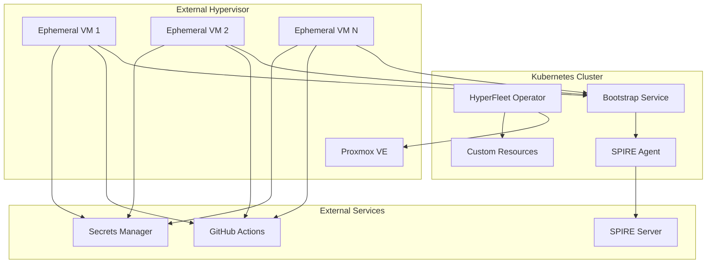
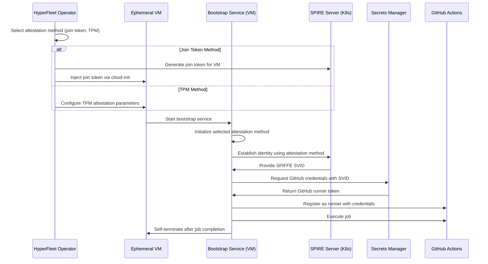
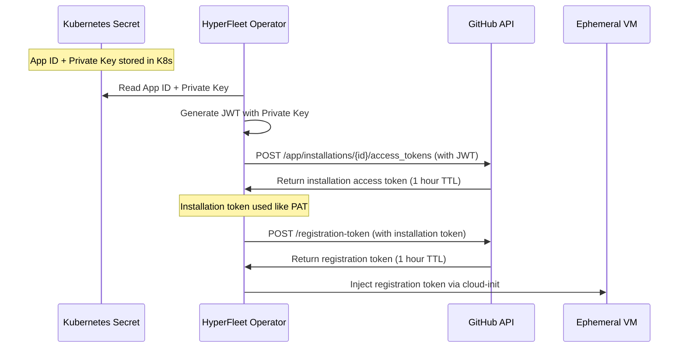
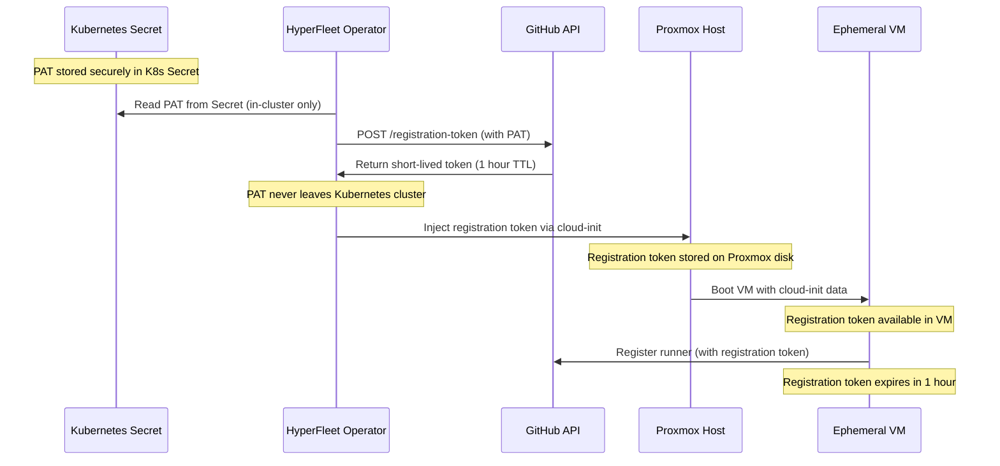

# Design Document: HyperFleet Operator

## Overview

HyperFleet is a Kubernetes-native operator that provisions and manages ephemeral virtual machines on external hypervisors for CI/CD workloads. The operator implements a VM-per-job execution model where each CI job runs on a fresh VM that is destroyed after completion. This design provides strong isolation, security, and resource efficiency while leveraging existing hypervisor infrastructure.

The system follows cloud-native principles with declarative APIs, reconciliation-based lifecycle management, and GitOps compatibility. It integrates with SPIFFE/SPIRE for secure identity management and supports autoscaling based on workload demand.

## Architecture

### High-Level Components



### VM Bootstrap Flow

The VM bootstrap process supports multiple attestation methods with join tokens as the default:



**Key Points**:
- Multiple attestation methods supported: join tokens (default), TPM
- Attestation method selection configurable per HypervisorMachineTemplate
- Bootstrap service adapts to configured attestation method
- All methods result in SPIFFE SVID for secrets manager authentication
- Extensible design allows adding new attestation methods

### Component Responsibilities

- **HyperFleet Operator**: Core controller managing VM lifecycle, reconciliation, and SPIRE join token generation
- **VM Bootstrap Service**: Service running on each VM that handles SPIRE registration and credential acquisition
- **Custom Resources**: Declarative API for hypervisor and VM management
- **SPIRE Server**: Kubernetes-hosted identity server that issues SVIDs to registered VMs
- **Proxmox Provider**: Hypervisor-specific implementation for VM operations
- **Secrets Manager**: External system storing GitHub credentials (accessed via SPIFFE SVID)

## Components and Interfaces

### Custom Resource Definitions

#### HypervisorCluster

Defines connection and configuration for a hypervisor environment, including DNS settings.

```yaml
apiVersion: hyperfleet.io/v1alpha1
kind: HypervisorCluster
metadata:
  name: proxmox-prod
spec:
  provider: proxmox
  endpoint: https://pve.example.com:8006/api2/json
  
  # Credentials using secretKeyRef pattern
  credentials:
    # API Token authentication (recommended)
    tokenId:
      secretKeyRef:
        name: proxmox-credentials
        key: tokenId
        namespace: hyperfleet-system
    tokenSecret:
      secretKeyRef:
        name: proxmox-credentials
        key: tokenSecret
        namespace: hyperfleet-system
    
    # Alternative: Username/Password authentication
    # username:
    #   secretKeyRef:
    #     name: proxmox-credentials
    #     key: username
    #     namespace: hyperfleet-system
    # password:
    #   secretKeyRef:
    #     name: proxmox-credentials
    #     key: password
    #     namespace: hyperfleet-system
  
  nodes:
    - pve-node-1
    - pve-node-2
  defaultStorage: local-lvm
  defaultNetwork: vmbr0
  
  # DNS configuration for VMs created on this cluster
  dns:
    domain: hyperfleet.local        # Default domain for VM FQDNs
    servers:                        # DNS servers for VMs
      - 192.168.1.1
      - 8.8.8.8
    registerVMs: false              # Whether to register VMs in DNS
    dnsProvider:                    # Optional: external DNS provider config
      type: route53                 # route53, cloudflare, etc.
      credentials:
        accessKeyId:
          secretKeyRef:
            name: dns-credentials
            key: accessKeyId
            namespace: hyperfleet-system
        secretAccessKey:
          secretKeyRef:
            name: dns-credentials
            key: secretAccessKey
            namespace: hyperfleet-system
  
  tags:
    environment: production
    managed-by: hyperfleet
status:
  conditions:
    - type: Ready
      status: "True"
      lastTransitionTime: "2024-01-01T00:00:00Z"
  connectedNodes: 2
  availableResources:
    cpu: 64
    memory: 512Gi
    storage: 10Ti
```

#### HypervisorMachineTemplate

Defines reusable VM template specifications with support for multiple attestation methods including dynamic GitHub runner token generation.

```yaml
apiVersion: hyperfleet.io/v1alpha1
kind: HypervisorMachineTemplate
metadata:
  name: github-runner-template
spec:
  hypervisorClusterRef:
    name: proxmox-prod
  template:
    proxmox:
      templateId: 9000
      clone: true
      linkedClone: true
  resources:
    cpu: 4
    memory: 8Gi
    disk: 50Gi
  attestation:
    method: join-token  # Options: join-token, tpm
    config:
      joinTokenTTL: 1h
      # For TPM method:
      # tpmDevice: /dev/tpm0
  
  bootstrap:
    method: runner-token  # Options: runner-token, external-secrets
    config:
      # GitHub configuration (for runner-token method)
      github:
          # Option 1: GitHub App credentials (recommended for production)
          app:
            appId:
              secretKeyRef:
                name: github-app-credentials
                key: app-id
                namespace: hyperfleet-system
            privateKey:
              secretKeyRef:
                name: github-app-credentials
                key: private-key
                namespace: hyperfleet-system
            installationId:
              secretKeyRef:
                name: github-app-credentials
                key: installation-id
                namespace: hyperfleet-system
          
          # Option 2: PAT credentials (simpler setup, less secure)
          # credentials:
          #   secretKeyRef:
          #     name: github-credentials
          #     key: pat-token
          #     namespace: hyperfleet-system
          
          # Repository or organization (repo takes precedence)
          owner: "codihuston"
          repository: "hyperfleet-controller"  # Optional: if specified, creates repo-level runner
          # organization: "myorg"              # Optional: if no repo, creates org-level runner
          
          # Registration URLs (configurable, with sensible defaults)
          registrationUrls:
            repository: "https://api.github.com/repos/{owner}/{repo}/actions/runners/registration-token"
            organization: "https://api.github.com/orgs/{owner}/actions/runners/registration-token"
          
          # Runner configuration URLs (where runner registers to)
          runnerUrls:
            repository: "https://github.com/{owner}/{repo}"
            organization: "https://github.com/{owner}"
          
          # GitHub Actions runner configuration
          runner:
            # Download URL for GitHub Actions runner (supports OS/arch templating)
            downloadUrl: "https://github.com/actions/runner/releases/download/v2.311.0/actions-runner-{os}-{arch}-2.311.0.tar.gz"
            # Installation path on VM
            installPath: "/opt/actions-runner"
            # Working directory for jobs
            workDir: "/tmp/runner-work"
            # Script names (configurable in case GitHub changes them)
            configScript: "config.sh"
            runScript: "run.sh"
            # Target OS and architecture (defaults to runtime values or env vars)
            os: "linux"      # Can be overridden by GOOS env var
            arch: "x64"      # Can be overridden by GOARCH env var (mapped to GitHub naming)
        
        # Global HTTP client configuration
        httpClient:
          timeoutSeconds: 30  # Configurable timeout, default 30s
  
  cloudInit:
    userData: |
      #cloud-config
      packages:
        - docker.io
        - git
        - curl
        - jq
      
      write_files:
        - path: /etc/hyperfleet/runner-config.json
          content: |
            {
              "method": "{{ .WorkloadMethod }}",
              "platform": "github-actions",
              {{ if .SPIFFEEnabled }}
              "spiffe": {
                "enabled": true,
                "join_token": "{{ .JoinToken }}",
                "spiffe_id": "{{ .SPIFFEID }}"
              },
              {{ end }}
              {{ if eq .BootstrapMethod "runner-token" }}
              "runner_token": "{{ .RunnerToken }}",
              "registration_url": "{{ .RegistrationURL }}",
              "runner_name": "{{ .RunnerName }}",
              "labels": {{ .Labels | toJson }},
              "expires_at": "{{ .ExpiresAt }}",
              "runner": {
                "download_url": "{{ .RunnerConfig.DownloadUrl }}",
                "install_path": "{{ .RunnerConfig.InstallPath }}",
                "work_dir": "{{ .RunnerConfig.WorkDir }}",
                "config_script": "{{ .RunnerConfig.ConfigScript }}",
                "run_script": "{{ .RunnerConfig.RunScript }}",
                "os": "{{ .RunnerConfig.OS }}",
                "arch": "{{ .RunnerConfig.Arch }}"
              }
              {{ end }}
            }
          permissions: '0600'
        
        # Bootstrap service binary (pre-built and embedded in template)
        - path: /opt/hyperfleet/bootstrap-service
          content: {{ .BootstrapServiceBinary | base64 }}
          permissions: '0755'
          encoding: base64
        
        - path: /etc/systemd/system/hyperfleet-bootstrap.service
          content: |
            [Unit]
            Description=HyperFleet VM Bootstrap Service
            After=network-online.target
            Wants=network-online.target
            
            [Service]
            Type=exec
            ExecStart=/opt/hyperfleet/bootstrap-service --config /etc/hyperfleet/runner-config.json
            Restart=no
            User=root
            
            [Install]
            WantedBy=multi-user.target
          permissions: '0644'
      
      runcmd:
        - systemctl daemon-reload
        - systemctl enable hyperfleet-bootstrap.service
        - systemctl start hyperfleet-bootstrap.service
  
  metadata:
    labels:
      hyperfleet.io/template: github-runner
    annotations:
      hyperfleet.io/description: "GitHub Actions runner template with dynamic token generation"
```

#### RunnerPool

Defines workload intent and scaling policies with pluggable workload types.

```yaml
apiVersion: hyperfleet.io/v1alpha1
kind: RunnerPool
metadata:
  name: ci-runners
spec:
  templateRef:
    name: github-runner-template
  workload:
    type: github-actions  # Options: github-actions, gitlab-ci, buildkite, generic
    config:
      # GitHub Actions specific config
      github:
        organization: myorg
        labels:
          - self-hosted
          - linux
          - x64
        runnerGroup: default
      # GitLab CI specific config (future)
      # gitlab:
      #   url: https://gitlab.example.com
      #   tags:
      #     - docker
      #     - linux
      # Buildkite specific config (future)  
      # buildkite:
      #   organization: myorg
      #   queue: default
      #   tags:
      #     - docker
      #     - linux
  scaling:
    minReplicas: 0
    maxReplicas: 10
    scaleDownDelay: 300s
  lifecycle:
    maxLifetime: 1h
    idleTimeout: 5m
    jobTimeout: 30m
status:
  replicas: 3
  readyReplicas: 2
  conditions:
    - type: Scaling
      status: "True"
      reason: DemandIncreased
```

#### MachineClaim

Represents a single desired VM instance.

```yaml
apiVersion: hyperfleet.io/v1alpha1
kind: MachineClaim
metadata:
  name: runner-abc123
  finalizers:
    - hyperfleet.io/vm-cleanup
spec:
  templateRef:
    name: github-runner-template
  runnerPoolRef:
    name: ci-runners
  workloadConfig:
    type: github-actions
    config:
      github:
        runnerName: runner-abc123
        labels:
          - self-hosted
          - ephemeral
status:
  phase: Ready
  conditions:
    - type: Provisioning
      status: "False"
      lastTransitionTime: "2024-01-01T00:00:00Z"
    - type: Bootstrapped
      status: "True"
      lastTransitionTime: "2024-01-01T00:01:00Z"
    - type: Ready
      status: "True"
      lastTransitionTime: "2024-01-01T00:02:00Z"
  vmRef:
    hypervisorCluster: proxmox-prod
    vmId: "101"
    node: pve-node-1
  networkInfo:
    ipAddress: 192.168.1.100
    macAddress: "52:54:00:12:34:56"
```

### Controller Architecture

#### HyperFleet Operator Controllers

```go
// Controller interfaces following controller-runtime patterns
type HypervisorClusterReconciler struct {
    client.Client
    Scheme *runtime.Scheme
    ProviderFactory ProviderFactory
}

type MachineClaimReconciler struct {
    client.Client
    Scheme *runtime.Scheme
    ProviderFactory ProviderFactory
    SPIREClient SPIREClient  // For join token generation
}

type RunnerPoolReconciler struct {
    client.Client
    Scheme *runtime.Scheme
    ScalingEngine ScalingEngine
}
```

### Controller Implementation Details

### Network Configuration and Identity

#### Hostname Strategy

VMs get hostnames derived from MachineClaim names for consistency and traceability:

```go
// Hostname generation for VMs
func (r *MachineClaimReconciler) generateHostname(claim *hyperfleetv1alpha1.MachineClaim) string {
    // Use MachineClaim name as hostname (DNS-safe)
    // Kubernetes names are already DNS-compliant (RFC 1123)
    hostname := claim.Name
    
    // Optionally add namespace prefix for multi-tenant environments
    if r.config.IncludeNamespaceInHostname {
        hostname = fmt.Sprintf("%s-%s", claim.Namespace, claim.Name)
    }
    
    return hostname
}

// Cloud-init hostname configuration
func (r *MachineClaimReconciler) generateCloudInitNetworkConfig(claim *hyperfleetv1alpha1.MachineClaim, template *hyperfleetv1alpha1.HypervisorMachineTemplate) *NetworkConfig {
    hostname := r.generateHostname(claim)
    
    return &NetworkConfig{
        Hostname: hostname,
        FQDN:     fmt.Sprintf("%s.%s", hostname, r.config.DNSDomain), // e.g., runner-abc123.hyperfleet.local
        
        // Network configuration based on template
        NetworkMode: template.Spec.Network.Mode, // dhcp, static, or cloud-init managed
        
        // DHCP configuration (most common)
        DHCP: &DHCPConfig{
            Enabled:        true,
            SendHostname:   true,  // Send hostname to DHCP server for DNS registration
            UseRoutes:      true,
            UseDNS:         true,
        },
        
        // Static IP configuration (if specified in template)
        StaticConfig: template.Spec.Network.StaticConfig,
    }
}
```

#### Network Configuration Options

```yaml
# HypervisorMachineTemplate with network configuration
apiVersion: hyperfleet.io/v1alpha1
kind: HypervisorMachineTemplate
metadata:
  name: github-runner-template
spec:
  hypervisorClusterRef:
    name: proxmox-prod
  template:
    proxmox:
      templateId: 9000
      clone: true
      linkedClone: true
  resources:
    cpu: 4
    memory: 8Gi
    disk: 50Gi
  network:
    mode: dhcp  # Options: dhcp, static, cloud-init
    bridge: vmbr0
    vlan: 100  # Optional VLAN tagging
    
    # DHCP configuration (default)
    dhcp:
      sendHostname: true
      requestStaticLease: true  # Request same IP for hostname
    
    # Static IP configuration (optional)
    # static:
    #   ipAddress: 192.168.1.100
    #   netmask: 255.255.255.0
    #   gateway: 192.168.1.1
    #   dns:
    #     - 192.168.1.1
    #     - 8.8.8.8
    
    # DNS configuration
    dns:
      domain: hyperfleet.local
      search:
        - hyperfleet.local
        - ci.local
  
  # Cloud-init network template
  cloudInit:
    networkData: |
      version: 2
      ethernets:
        eth0:
          {{ if eq .NetworkMode "dhcp" }}
          dhcp4: true
          dhcp-identifier: mac
          {{ else if eq .NetworkMode "static" }}
          addresses:
            - {{ .StaticIP }}/{{ .NetmaskBits }}
          gateway4: {{ .Gateway }}
          nameservers:
            addresses: {{ .DNSServers }}
          {{ end }}
      
    userData: |
      #cloud-config
      hostname: {{ .Hostname }}
      fqdn: {{ .FQDN }}
      
      # Set hostname in /etc/hosts
      manage_etc_hosts: true
      
      # Configure hostname persistence
      preserve_hostname: false
      
      # Network configuration
      write_files:
        - path: /etc/hyperfleet/network.conf
          content: |
            HOSTNAME={{ .Hostname }}
            FQDN={{ .FQDN }}
            NETWORK_MODE={{ .NetworkMode }}
          permissions: '0644'
```

#### DHCP with Server-Side Static Assignment

For your use case (DHCP with server-side static IPs), the configuration would be:

```yaml
# Template configuration for DHCP with static server-side assignment
network:
  mode: dhcp
  bridge: vmbr0
  dhcp:
    sendHostname: true          # Send hostname to DHCP server
    requestStaticLease: true    # Request consistent IP for this hostname
    clientIdentifier: hostname  # Use hostname as DHCP client ID
```

```go
// DHCP configuration for static server-side assignment
type DHCPConfig struct {
    Enabled           bool   `json:"enabled"`
    SendHostname      bool   `json:"sendHostname"`      // Send hostname in DHCP request
    RequestStaticLease bool  `json:"requestStaticLease"` // Request same IP for hostname
    ClientIdentifier  string `json:"clientIdentifier"`  // "mac", "hostname", or custom
    LeaseTime         string `json:"leaseTime,omitempty"` // Requested lease time
}

// Cloud-init DHCP configuration
func (r *MachineClaimReconciler) generateDHCPConfig(claim *hyperfleetv1alpha1.MachineClaim, template *hyperfleetv1alpha1.HypervisorMachineTemplate) string {
    hostname := r.generateHostname(claim)
    
    if template.Spec.Network.DHCP.ClientIdentifier == "hostname" {
        return fmt.Sprintf(`
network:
  version: 2
  ethernets:
    eth0:
      dhcp4: true
      dhcp4-overrides:
        send-hostname: true
        hostname: %s
      dhcp-identifier: duid  # Use hostname-based DUID
`, hostname)
    }
    
    // Default MAC-based DHCP
    return `
network:
  version: 2
  ethernets:
    eth0:
      dhcp4: true
      dhcp-identifier: mac
`
}
```

#### DNS and Service Discovery

```go
// DNS configuration for VM discovery
type DNSConfig struct {
    Domain     string   `json:"domain"`      // e.g., "hyperfleet.local"
    Search     []string `json:"search"`      // DNS search domains
    Servers    []string `json:"servers"`     // DNS servers
    RegisterVM bool     `json:"registerVM"`  // Register VM in DNS
}

// VM DNS registration (optional)
func (r *MachineClaimReconciler) registerVMInDNS(ctx context.Context, claim *hyperfleetv1alpha1.MachineClaim, vmInfo *VMInfo) error {
    if !r.config.DNS.RegisterVM {
        return nil
    }
    
    hostname := r.generateHostname(claim)
    fqdn := fmt.Sprintf("%s.%s", hostname, r.config.DNS.Domain)
    
    // Register A record in DNS (implementation depends on DNS provider)
    return r.dnsClient.RegisterARecord(ctx, fqdn, vmInfo.IPAddress, 300) // 5 min TTL
}
```

#### SPIFFE ID Naming Strategy

Each MachineClaim gets a unique SPIFFE ID while maintaining logical grouping:

Each MachineClaim gets a unique SPIFFE ID while maintaining logical grouping:

```go
// SPIFFE ID generation for individual VMs
func (r *MachineClaimReconciler) generateSPIFFEID(claim *hyperfleetv1alpha1.MachineClaim, template *hyperfleetv1alpha1.HypervisorMachineTemplate) string {
    // Base SPIFFE ID pattern: spiffe://hyperfleet.io/vm/{namespace}/{machine-claim-name}
    baseID := fmt.Sprintf("spiffe://hyperfleet.io/vm/%s/%s", claim.Namespace, claim.Name)
    
    // Add unique suffix to ensure no collisions (even with recreated MachineClaims)
    uniqueID := fmt.Sprintf("%s/%s", baseID, claim.UID)
    
    return uniqueID
}

// Example SPIFFE IDs:
// spiffe://hyperfleet.io/vm/default/runner-abc123/550e8400-e29b-41d4-a716-446655440000
// spiffe://hyperfleet.io/vm/ci-system/gitlab-runner-xyz/550e8400-e29b-41d4-a716-446655440001
// spiffe://hyperfleet.io/vm/default/buildkite-agent-456/550e8400-e29b-41d4-a716-446655440002

// SPIRE selectors for grouping and policy
func (r *MachineClaimReconciler) generateSPIRESelectors(claim *hyperfleetv1alpha1.MachineClaim, template *hyperfleetv1alpha1.HypervisorMachineTemplate) []string {
    return []string{
        fmt.Sprintf("hyperfleet:namespace:%s", claim.Namespace),
        fmt.Sprintf("hyperfleet:machine-claim:%s", claim.Name),
        fmt.Sprintf("hyperfleet:template:%s", template.Name),
        fmt.Sprintf("hyperfleet:runner-pool:%s", claim.Spec.RunnerPoolRef.Name),
        fmt.Sprintf("hyperfleet:workload-type:%s", claim.Spec.WorkloadConfig.Type),
    }
}
```

**MachineClaim Lifecycle and Naming**:

```go
// MachineClaim naming follows Kubernetes conventions
type MachineClaimSpec struct {
    // Reference to the VM template to use
    TemplateRef ObjectReference `json:"templateRef"`
    
    // Reference to the RunnerPool that created this claim (optional)
    RunnerPoolRef *ObjectReference `json:"runnerPoolRef,omitempty"`
    
    // Workload configuration for this specific VM
    WorkloadConfig WorkloadConfig `json:"workloadConfig"`
}

// MachineClaim creation patterns:

// 1. Manual creation (single VM)
apiVersion: hyperfleet.io/v1alpha1
kind: MachineClaim
metadata:
  name: manual-runner-001  # User-defined name
  namespace: ci-system
spec:
  templateRef:
    name: github-runner-template
  workloadConfig:
    type: github-actions
    config:
      github:
        organization: myorg
        labels: [self-hosted, manual]

// 2. RunnerPool creation (managed VMs)
// RunnerPool controller creates MachineClaims with generated names:
// - ci-runners-abc123 (generated from RunnerPool name + random suffix)
// - ci-runners-def456
// - ci-runners-ghi789
```

**SPIFFE Identity Hierarchy**:

```
spiffe://hyperfleet.io/
├── vm/                           # All VMs
│   ├── {namespace}/             # Kubernetes namespace
│   │   ├── {machine-claim}/     # Individual MachineClaim
│   │   │   └── {uid}           # Unique instance ID
│   │   └── ...
│   └── ...
├── controller/                   # HyperFleet controllers
│   └── {cluster-name}/
└── bootstrap/                    # Bootstrap services
    └── {cluster-name}/
```

**Benefits of this approach**:
1. **Unique Identity**: Each VM has a globally unique SPIFFE ID
2. **Logical Grouping**: Can create SPIRE policies for namespaces, templates, or workload types
3. **Collision Prevention**: Using Kubernetes UID prevents conflicts from recreated MachineClaims
4. **Policy Flexibility**: SPIRE selectors allow fine-grained access control
5. **Audit Trail**: Clear mapping from SPIFFE ID back to Kubernetes resources

#### Join Token Generation and Cloud-Init Rendering

The MachineClaim controller handles join token generation and cloud-init template rendering:

```go
// MachineClaim controller reconciliation logic
func (r *MachineClaimReconciler) Reconcile(ctx context.Context, req ctrl.Request) (ctrl.Result, error) {
    var machineClaim hyperfleetv1alpha1.MachineClaim
    if err := r.Get(ctx, req.NamespacedName, &machineClaim); err != nil {
        return ctrl.Result{}, client.IgnoreNotFound(err)
    }

    // Handle deletion with finalizers
    if !machineClaim.DeletionTimestamp.IsZero() {
        return r.handleDeletion(ctx, &machineClaim)
    }

    // Get the referenced template
    template, err := r.getHypervisorMachineTemplate(ctx, machineClaim.Spec.TemplateRef)
    if err != nil {
        return ctrl.Result{}, err
    }

    // Check if VM exists and get its current state
    if machineClaim.Status.VMRef != nil {
        vmStatus, err := r.provider.GetVMStatus(ctx, machineClaim.Status.VMRef.VMID)
        if err != nil {
            return ctrl.Result{}, err
        }

        // Handle VM shutdown cleanup
        if vmStatus.PowerState == "stopped" || vmStatus.PowerState == "shutdown" {
            return r.handleVMShutdown(ctx, &machineClaim)
        }

        // Update status if VM is running
        return r.updateVMStatus(ctx, &machineClaim, vmStatus)
    }

    // Generate attestation credentials based on template configuration
    attestationData, err := r.generateAttestationData(ctx, &machineClaim, template)
    if err != nil {
        return ctrl.Result{}, err
    }

    // Render cloud-init with attestation data
    cloudInitData, err := r.renderCloudInit(template.Spec.CloudInit, attestationData)
    if err != nil {
        return ctrl.Result{}, err
    }

    // Provision VM with rendered cloud-init
    vmInfo, err := r.provisionVM(ctx, &machineClaim, template, cloudInitData)
    if err != nil {
        return ctrl.Result{}, err
    }

    // Update MachineClaim status
    return r.updateStatus(ctx, &machineClaim, vmInfo)
}

// Handle VM shutdown and cleanup
func (r *MachineClaimReconciler) handleVMShutdown(ctx context.Context, claim *hyperfleetv1alpha1.MachineClaim) (ctrl.Result, error) {
    log := r.Log.WithValues("machineclaim", claim.Name, "namespace", claim.Namespace)
    
    if claim.Status.VMRef == nil {
        return ctrl.Result{}, nil
    }

    vmID := claim.Status.VMRef.VMID
    log.Info("VM has shutdown, initiating cleanup", "vmID", vmID)

    // Validate ownership before cleanup
    if err := r.provider.ValidateVMOwnership(ctx, vmID); err != nil {
        log.Error(err, "ownership validation failed during shutdown cleanup", "vmID", vmID)
        return ctrl.Result{}, err
    }

    // Delete VM from hypervisor
    if err := r.provider.DeleteVM(ctx, vmID); err != nil {
        log.Error(err, "failed to delete shutdown VM", "vmID", vmID)
        // Update status to reflect cleanup failure
        r.updateCleanupFailedStatus(ctx, claim, err)
        return ctrl.Result{RequeueAfter: time.Minute * 2}, nil
    }

    log.Info("Successfully deleted shutdown VM", "vmID", vmID)

    // Update MachineClaim status to indicate VM cleanup completed
    claim.Status.Phase = hyperfleetv1alpha1.MachineClaimPhaseTerminating
    condition := metav1.Condition{
        Type:               "VMCleanedUp",
        Status:             metav1.ConditionTrue,
        LastTransitionTime: metav1.Now(),
        Reason:             "VMShutdownDetected",
        Message:            fmt.Sprintf("VM %s was shutdown and successfully cleaned up", vmID),
    }
    meta.SetStatusCondition(&claim.Status.Conditions, condition)

    if err := r.Status().Update(ctx, claim); err != nil {
        return ctrl.Result{}, err
    }

    // If this MachineClaim is managed by a RunnerPool, the RunnerPool controller
    // will detect the terminating state and create a replacement if needed
    
    // Delete the MachineClaim resource (this will trigger finalizer cleanup)
    if err := r.Delete(ctx, claim); err != nil {
        return ctrl.Result{}, err
    }

    return ctrl.Result{}, nil
}

// Periodic VM state monitoring for cleanup
func (r *MachineClaimReconciler) startVMStateMonitor(ctx context.Context) {
    ticker := time.NewTicker(30 * time.Second) // Check every 30 seconds
    defer ticker.Stop()

    for {
        select {
        case <-ctx.Done():
            return
        case <-ticker.C:
            if err := r.reconcileVMStates(ctx); err != nil {
                r.Log.Error(err, "failed to reconcile VM states")
            }
        }
    }
}

// Reconcile all VM states and cleanup shutdown VMs
func (r *MachineClaimReconciler) reconcileVMStates(ctx context.Context) error {
    // List all MachineClaims with active VMs
    var machineClaimList hyperfleetv1alpha1.MachineClaimList
    if err := r.List(ctx, &machineClaimList); err != nil {
        return err
    }

    for _, claim := range machineClaimList.Items {
        // Skip claims without VM references or already terminating
        if claim.Status.VMRef == nil || claim.Status.Phase == hyperfleetv1alpha1.MachineClaimPhaseTerminating {
            continue
        }

        // Check VM status
        vmStatus, err := r.provider.GetVMStatus(ctx, claim.Status.VMRef.VMID)
        if err != nil {
            r.Log.Error(err, "failed to get VM status during state reconciliation", 
                "machineclaim", claim.Name, "vmID", claim.Status.VMRef.VMID)
            continue
        }

        // Trigger cleanup for shutdown VMs
        if vmStatus.PowerState == "stopped" || vmStatus.PowerState == "shutdown" {
            r.Log.Info("Found shutdown VM during state reconciliation", 
                "machineclaim", claim.Name, "vmID", claim.Status.VMRef.VMID)
            
            // Enqueue reconciliation for this MachineClaim
            r.Reconcile(ctx, ctrl.Request{
                NamespacedName: types.NamespacedName{
                    Name:      claim.Name,
                    Namespace: claim.Namespace,
                },
            })
        }
    }

    return nil
}

// Generate attestation data based on template configuration
func (r *MachineClaimReconciler) generateAttestationData(ctx context.Context, 
    claim *hyperfleetv1alpha1.MachineClaim, 
    template *hyperfleetv1alpha1.HypervisorMachineTemplate) (*AttestationData, error) {
    
    switch template.Spec.Attestation.Method {
    case "join-token":
        // Generate unique SPIFFE ID for this VM
        spiffeID := r.generateSPIFFEID(claim, template)
        selectors := r.generateSPIRESelectors(claim, template)
        
        // Generate SPIRE join token
        joinToken, err := r.spireClient.GenerateJoinToken(ctx, &spire.JoinTokenRequest{
            SPIFFEID:  spiffeID,
            TTL:       template.Spec.Attestation.Config.JoinTokenTTL,
            Selectors: selectors,
        })
        if err != nil {
            return nil, fmt.Errorf("failed to generate join token: %w", err)
        }
        
        return &AttestationData{
            Method:    "join-token",
            JoinToken: joinToken.Token,
            SPIFFEID:  spiffeID,
            ExpiresAt: joinToken.ExpiresAt,
        }, nil
        
    case "tpm":
        // Configure TPM attestation parameters
        spiffeID := r.generateSPIFFEID(claim, template)
        return &AttestationData{
            Method:    "tpm",
            TPMDevice: template.Spec.Attestation.Config.TPMDevice,
            SPIFFEID:  spiffeID,
        }, nil
        
    default:
        return nil, fmt.Errorf("unsupported attestation method: %s", template.Spec.Attestation.Method)
    }
}

// Generate bootstrap data based on template configuration
func (r *MachineClaimReconciler) generateBootstrapData(ctx context.Context, 
    claim *hyperfleetv1alpha1.MachineClaim, 
    template *hyperfleetv1alpha1.HypervisorMachineTemplate) (*BootstrapData, error) {
    
    switch template.Spec.Bootstrap.Method {
    case "runner-token":
        // Generate GitHub registration token dynamically
        return r.generateGitHubRegistrationToken(ctx, claim, template)
        
    default:
        return nil, fmt.Errorf("unsupported attestation method: %s", template.Spec.Attestation.Method)
    }
}

// GitHub registration token generation with configurable URLs and timeouts
// SECURITY: PAT never leaves Kubernetes - only short-lived registration tokens are exposed to VMs
func (r *MachineClaimReconciler) generateGitHubRegistrationToken(ctx context.Context,
    claim *hyperfleetv1alpha1.MachineClaim,
    template *hyperfleetv1alpha1.HypervisorMachineTemplate) (*BootstrapData, error) {
    
    config := template.Spec.Bootstrap.Config.GitHub
    
    // Get GitHub PAT from secret (PAT stays within Kubernetes cluster)
    pat, err := r.getSecretValue(ctx, config.Credentials)
    if err != nil {
        return nil, fmt.Errorf("failed to get GitHub PAT: %w", err)
    }
    
    // Determine registration URL and runner URL
    var registrationURL, runnerURL string
    
    if config.Repository != "" && config.Organization != "" {
        // Both specified - prefer repository and log warning
        r.Log.Info("Both repository and organization specified, preferring repository",
            "repository", fmt.Sprintf("%s/%s", config.Owner, config.Repository),
            "organization", config.Organization,
            "machineClaim", claim.Name)
    }
    
    if config.Repository != "" {
        // Repository-level runner (preferred)
        registrationURL = r.expandURL(config.RegistrationUrls.Repository, config.Owner, config.Repository, "")
        runnerURL = r.expandURL(config.RunnerUrls.Repository, config.Owner, config.Repository, "")
    } else if config.Organization != "" {
        // Organization-level runner
        registrationURL = r.expandURL(config.RegistrationUrls.Organization, config.Owner, "", config.Organization)
        runnerURL = r.expandURL(config.RunnerUrls.Organization, config.Owner, "", config.Organization)
    } else {
        return nil, fmt.Errorf("either repository or organization must be specified")
    }
    
    // Create HTTP client with configurable timeout
    timeout := time.Duration(template.Spec.Attestation.Config.HTTPClient.TimeoutSeconds) * time.Second
    if timeout == 0 {
        timeout = 30 * time.Second // Default
    }
    
    client := &http.Client{Timeout: timeout}
    req, err := http.NewRequestWithContext(ctx, "POST", registrationURL, nil)
    if err != nil {
        return nil, fmt.Errorf("failed to create request: %w", err)
    }
    
    req.Header.Set("Accept", "application/vnd.github+json")
    req.Header.Set("Authorization", fmt.Sprintf("Bearer %s", pat))
    req.Header.Set("X-GitHub-Api-Version", "2022-11-28")
    
    resp, err := client.Do(req)
    if err != nil {
        return nil, fmt.Errorf("failed to call GitHub API: %w", err)
    }
    defer resp.Body.Close()
    
    if resp.StatusCode != http.StatusCreated {
        body, _ := io.ReadAll(resp.Body)
        return nil, fmt.Errorf("GitHub API error %d: %s", resp.StatusCode, string(body))
    }
    
    // Parse response matching GitHub's exact format
    var tokenResp struct {
        Token     string `json:"token"`
        ExpiresAt string `json:"expires_at"` // GitHub returns RFC3339 string
    }
    
    if err := json.NewDecoder(resp.Body).Decode(&tokenResp); err != nil {
        return nil, fmt.Errorf("failed to decode response: %w", err)
    }
    
    // Parse the expires_at timestamp
    expiresAt, err := time.Parse(time.RFC3339, tokenResp.ExpiresAt)
    if err != nil {
        return nil, fmt.Errorf("failed to parse expires_at: %w", err)
    }
    
    // Generate unique runner name
    runnerName := fmt.Sprintf("%s-%s", claim.Name, claim.UID[:8])
    
    // Get labels from workload config
    labels := []string{"self-hosted", "hyperfleet", "ephemeral"}
    if workloadConfig := claim.Spec.WorkloadConfig; workloadConfig.Type == "github-actions" {
        if githubConfig, ok := workloadConfig.Config["github"].(map[string]interface{}); ok {
            if configLabels, ok := githubConfig["labels"].([]string); ok {
                labels = append(labels, configLabels...)
            }
        }
    }
    
    return &BootstrapData{
        Method:          "runner-token",
        Platform:        "github-actions",
        RunnerToken:     tokenResp.Token,
        RegistrationURL: runnerURL, // Where the runner registers to (not the API endpoint)
        RunnerName:      runnerName,
        Labels:          labels,
        ExpiresAt:       expiresAt,
        
        // GitHub runner configuration
        RunnerConfig: RunnerConfigData{
            DownloadUrl: config.Runner.DownloadUrl,
            InstallPath: config.Runner.InstallPath,
            WorkDir:     config.Runner.WorkDir,
        },
    }, nil
}

// Helper to expand URL templates
func (r *MachineClaimReconciler) expandURL(template, owner, repo, org string) string {
    url := strings.ReplaceAll(template, "{owner}", owner)
    url = strings.ReplaceAll(url, "{repo}", repo)
    url = strings.ReplaceAll(url, "{org}", org)
    return url
}

### GitHub Credentials Configuration

GitHub PATs are stored securely in Kubernetes Secrets and never leave the cluster:

```yaml
# GitHub credentials secret (PAT never leaves Kubernetes)
apiVersion: v1
kind: Secret
metadata:
  name: github-credentials
  namespace: hyperfleet-system
  annotations:
    hyperfleet.io/description: "GitHub PAT for runner registration token generation"
type: Opaque
data:
  pat-token: <base64-encoded-github-pat>
  # Alternative: GitHub App credentials (recommended for production)
  # app-id: <base64-encoded-app-id>
  # private-key: <base64-encoded-private-key>

---
# RBAC for accessing GitHub credentials (operator only)
apiVersion: rbac.authorization.k8s.io/v1
kind: Role
metadata:
  namespace: hyperfleet-system
  name: hyperfleet-github-credentials
rules:
- apiGroups: [""]
  resources: ["secrets"]
  resourceNames: ["github-credentials"]
  verbs: ["get"]
```

**Security Notes:**
- **PAT Security**: GitHub PAT remains within Kubernetes cluster boundaries
- **Minimal Permissions**: PAT only needs `repo:actions` or `org:actions` scope
- **RBAC Protection**: Only HyperFleet operator can access the secret
- **Audit Trail**: All PAT usage logged through Kubernetes audit logs
- **Token Exchange**: PAT used only to generate short-lived registration tokens
- **No VM Exposure**: PAT never appears in cloud-init, VM filesystem, or Proxmox storage

### GitHub Apps vs Personal Access Tokens (PATs)

GitHub Apps provide superior security compared to PATs for automated systems like HyperFleet:

#### Security Comparison

| Aspect | Personal Access Token (PAT) | GitHub App |
|--------|----------------------------|------------|
| **Identity** | Tied to user account | Independent app identity |
| **Permissions** | User's full permissions | Granular, app-specific permissions |
| **Scope** | Broad (all repos user can access) | Specific repositories/organizations |
| **Revocation** | User can revoke, breaking automation | Organization controls, predictable lifecycle |
| **Audit Trail** | Actions appear as user | Clear "app" attribution in logs |
| **Rate Limits** | Shared with user's other activities | Dedicated rate limits for the app |
| **Expiration** | Manual rotation required | Automatic JWT-based authentication |
| **Compromise Impact** | Full user access exposed | Limited to app's specific permissions |

#### GitHub App Authentication Flow



#### Why GitHub Apps are More Secure

**1. Principle of Least Privilege:**
```yaml
# GitHub App permissions (granular)
permissions:
  actions: write          # Only Actions scope
  metadata: read         # Basic repo metadata
  # No access to code, issues, PRs, etc.

# vs PAT permissions (broader)
scopes:
  - repo                 # Full repository access
  # or
  - public_repo         # Still broader than needed
```

**2. Identity Isolation:**
- **PAT**: Actions appear as the user who created the token
- **GitHub App**: Actions clearly attributed to "HyperFleet App"
- **Audit benefit**: Clear separation between human and automated actions

**3. Credential Rotation:**
```go
// GitHub App: Automatic token refresh
func (r *GitHubAppClient) getInstallationToken(ctx context.Context) (string, error) {
    // Generate JWT with private key (valid for 10 minutes)
    jwt := r.generateJWT()
    
    // Exchange JWT for installation token (valid for 1 hour)
    token, err := r.exchangeJWTForToken(ctx, jwt)
    if err != nil {
        return "", err
    }
    
    return token.Token, nil
}

// PAT: Manual rotation required
func (r *PATClient) getToken(ctx context.Context) (string, error) {
    // PAT must be manually rotated by user
    return r.staticPAT, nil
}
```

**4. Revocation Control:**
- **PAT**: User can revoke at any time, breaking automation unexpectedly
- **GitHub App**: Organization admins control installation, predictable lifecycle

**5. Rate Limiting:**
- **PAT**: Shares rate limits with user's other GitHub activities
- **GitHub App**: Dedicated rate limits (5,000 requests/hour per installation)

#### Implementation Differences

**PAT Configuration:**
```yaml
apiVersion: v1
kind: Secret
metadata:
  name: github-credentials
data:
  pat-token: <base64-encoded-pat>  # Long-lived, static token
```

**GitHub App Configuration:**
```yaml
apiVersion: v1
kind: Secret
metadata:
  name: github-app-credentials
data:
  app-id: <base64-encoded-app-id>           # Public app identifier
  private-key: <base64-encoded-private-key>  # RSA private key for JWT signing
  installation-id: <base64-encoded-inst-id>  # Installation ID for organization
```

**Controller Implementation Changes:**
```go
// GitHub App authentication
func (r *MachineClaimReconciler) generateGitHubAppToken(ctx context.Context, config GitHubAppConfig) (string, error) {
    // 1. Generate JWT signed with private key
    jwt, err := r.generateJWT(config.AppID, config.PrivateKey)
    if err != nil {
        return "", err
    }
    
    // 2. Exchange JWT for installation access token
    installationToken, err := r.exchangeJWTForInstallationToken(ctx, jwt, config.InstallationID)
    if err != nil {
        return "", err
    }
    
    return installationToken, nil
}

// Use installation token same as PAT for registration token generation
func (r *MachineClaimReconciler) generateRegistrationToken(ctx context.Context, accessToken string) (*RegistrationToken, error) {
    // Same API call, just using installation token instead of PAT
    req.Header.Set("Authorization", fmt.Sprintf("Bearer %s", accessToken))
    // ... rest of implementation identical
}
```

#### Security Benefits in HyperFleet Context

**1. Blast Radius Limitation:**
- **PAT compromise**: Attacker gets user's full GitHub access
- **GitHub App compromise**: Attacker only gets Actions permissions on specific repos

**2. Organizational Control:**
- **PAT**: Depends on individual user account security
- **GitHub App**: Managed by organization security policies

**3. Compliance and Auditing:**
- **PAT**: Actions mixed with user's personal GitHub activity
- **GitHub App**: Clear audit trail for automated actions

**4. Operational Resilience:**
- **PAT**: Breaks if user leaves organization or changes permissions
- **GitHub App**: Continues working as long as app is installed

#### Recommendation

**For Production Deployments:**
Use GitHub Apps for better security, auditability, and operational resilience:

```yaml
bootstrap:
  method: runner-token
  config:
    github:
      # Recommended: GitHub App credentials
      app:
        appId:
          secretKeyRef:
            name: github-app-credentials
            key: app-id
        privateKey:
          secretKeyRef:
            name: github-app-credentials
            key: private-key
        installationId:
          secretKeyRef:
            name: github-app-credentials
            key: installation-id
      
      # Alternative: PAT (simpler setup, less secure)
      # credentials:
      #   secretKeyRef:
      #     name: github-credentials
      #     key: pat-token
```

**For Development/Testing:**
PATs are acceptable for simplicity, but GitHub Apps should be used in production environments.

// Generate unique SPIFFE ID for each MachineClaim
func (r *MachineClaimReconciler) generateSPIFFEID(claim *hyperfleetv1alpha1.MachineClaim, template *hyperfleetv1alpha1.HypervisorMachineTemplate) string {
    return fmt.Sprintf("spiffe://hyperfleet.io/vm/%s/%s/%s", 
        claim.Namespace, 
        claim.Name, 
        claim.UID)
}

// Generate SPIRE selectors for policy and grouping
func (r *MachineClaimReconciler) generateSPIRESelectors(claim *hyperfleetv1alpha1.MachineClaim, template *hyperfleetv1alpha1.HypervisorMachineTemplate) []string {
    selectors := []string{
        fmt.Sprintf("hyperfleet:namespace:%s", claim.Namespace),
        fmt.Sprintf("hyperfleet:machine-claim:%s", claim.Name),
        fmt.Sprintf("hyperfleet:template:%s", template.Name),
        fmt.Sprintf("hyperfleet:workload-type:%s", claim.Spec.WorkloadConfig.Type),
    }
    
    // Add RunnerPool selector if this MachineClaim is managed by a RunnerPool
    if claim.Spec.RunnerPoolRef != nil {
        selectors = append(selectors, fmt.Sprintf("hyperfleet:runner-pool:%s", claim.Spec.RunnerPoolRef.Name))
    }
    
    return selectors
}
```

// Render cloud-init template with attestation data
func (r *MachineClaimReconciler) renderCloudInit(cloudInitTemplate hyperfleetv1alpha1.CloudInitData, 
    attestationData *AttestationData) (*CloudInitData, error) {
    
    // Create template context
    templateData := struct {
        AttestationMethod string
        JoinToken        string
        TPMDevice        string
        SPIFFEID         string
    }{
        AttestationMethod: attestationData.Method,
        JoinToken:        attestationData.JoinToken,
        TPMDevice:        attestationData.TPMDevice,
        SPIFFEID:         attestationData.SPIFFEID,
    }
    
    // Parse and execute template
    tmpl, err := template.New("cloudinit").Parse(cloudInitTemplate.UserData)
    if err != nil {
        return nil, fmt.Errorf("failed to parse cloud-init template: %w", err)
    }
    
    var buf bytes.Buffer
    if err := tmpl.Execute(&buf, templateData); err != nil {
        return nil, fmt.Errorf("failed to execute cloud-init template: %w", err)
    }
    
    return &CloudInitData{
        UserData: buf.String(),
        MetaData: cloudInitTemplate.MetaData,
    }, nil
}

// Data structures for attestation
type AttestationData struct {
    Method    string    `json:"method"`
    
    // SPIFFE/SPIRE fields (existing)
    JoinToken string    `json:"joinToken,omitempty"`
    SPIFFEID  string    `json:"spiffeId,omitempty"`
    
    // TPM fields (existing)
    TPMDevice string    `json:"tpmDevice,omitempty"`
    
    // GitHub runner token fields (new)
    Platform        string    `json:"platform,omitempty"`        // "github-actions"
    RunnerToken     string    `json:"runnerToken,omitempty"`     // Short-lived registration token
    RegistrationURL string    `json:"registrationUrl,omitempty"` // Where runner registers to
    RunnerName      string    `json:"runnerName,omitempty"`      // Unique runner name
    Labels          []string  `json:"labels,omitempty"`          // Runner labels
    
    // GitHub runner configuration
    RunnerConfig RunnerConfigData `json:"runnerConfig,omitempty"`
    
    ExpiresAt time.Time `json:"expiresAt,omitempty"`
}

// Runner configuration data for cloud-init templating
type RunnerConfigData struct {
    DownloadUrl string `json:"download_url,omitempty"` // GitHub Actions runner download URL
    InstallPath string `json:"install_path,omitempty"` // Installation path on VM
    WorkDir     string `json:"work_dir,omitempty"`     // Working directory for jobs
}
```

#### Example: Join Token Flow

1. **MachineClaim Creation**: User creates a MachineClaim referencing a HypervisorMachineTemplate
2. **Template Retrieval**: Controller fetches the template and reads attestation configuration
3. **Join Token Generation**: Controller calls SPIRE server to generate a join token with:
   - SPIFFE ID: `spiffe://hyperfleet.io/vm/{machine-claim-name}`
   - TTL: Configured in template (default 1 hour)
   - Selectors: Machine claim name, template name for attestation
4. **Template Rendering**: Controller renders cloud-init template with join token
5. **VM Provisioning**: Controller provisions VM with rendered cloud-init data
6. **VM Bootstrap**: VM boots, reads join token from cloud-init, establishes SPIFFE identity

#### Example Rendered Cloud-Init (Join Token Method)

```yaml
#cloud-config
packages:
  - docker.io
  - git
write_files:
  - path: /etc/hyperfleet/attestation.conf
    content: |
      method: join-token
      join_token: eyJhbGciOiJSUzI1NiIsInR5cCI6IkpXVCJ9...
    permissions: '0600'
  - path: /etc/hyperfleet/bootstrap.sh
    content: |
      #!/bin/bash
      # Start VM bootstrap service with attestation config
      /opt/hyperfleet/bootstrap-service --config /etc/hyperfleet/attestation.conf &
    permissions: '0755'
runcmd:
  - systemctl enable docker
  - systemctl start docker
  - /etc/hyperfleet/bootstrap.sh
```

### Proxmox Credentials Configuration

Proxmox VE supports multiple authentication methods. The credentials are stored in Kubernetes Secrets:

```yaml
# Username/Password authentication
apiVersion: v1
kind: Secret
metadata:
  name: proxmox-credentials
  namespace: hyperfleet-system
type: Opaque
data:
  username: cm9vdEBwYW0=        # base64: root@pam
  password: bXlzZWNyZXRwYXNz    # base64: mysecretpass

---
# API Token authentication (recommended)
apiVersion: v1
kind: Secret
metadata:
  name: proxmox-credentials
  namespace: hyperfleet-system
type: Opaque
data:
  tokenId: aHlwZXJmbGVldEBwdmUhbXl0b2tlbg==    # base64: hyperfleet@pve!mytoken
  tokenSecret: YWJjZGVmZ2gtaWprbC1tbm9wLXFyc3Q=  # base64: abcdefgh-ijkl-mnop-qrst

---
# Certificate-based authentication (advanced)
apiVersion: v1
kind: Secret
metadata:
  name: proxmox-credentials
  namespace: hyperfleet-system
type: kubernetes.io/tls
data:
  tls.crt: LS0tLS1CRUdJTi...  # Client certificate
  tls.key: LS0tLS1CRUdJTi...  # Client private key
```

```go
// Kubernetes-style secret key references
type SecretKeySelector struct {
    Name      string `json:"name"`
    Key       string `json:"key"`
    Namespace string `json:"namespace,omitempty"`
    Optional  *bool  `json:"optional,omitempty"`
}

type ProxmoxCredentials struct {
    // API Token authentication (recommended)
    TokenID     *SecretKeySelector `json:"tokenId,omitempty"`
    TokenSecret *SecretKeySelector `json:"tokenSecret,omitempty"`
    
    // Username/Password authentication
    Username *SecretKeySelector `json:"username,omitempty"`
    Password *SecretKeySelector `json:"password,omitempty"`
    
    // Certificate authentication
    ClientCert *SecretKeySelector `json:"clientCert,omitempty"`
    ClientKey  *SecretKeySelector `json:"clientKey,omitempty"`
}

// Load credentials using secretKeyRef pattern
func (p *ProxmoxProvider) loadCredentials(ctx context.Context, credentials ProxmoxCredentials) (*ProxmoxAuth, error) {
    // API Token authentication
    if credentials.TokenID != nil && credentials.TokenSecret != nil {
        tokenID, err := p.getSecretValue(ctx, credentials.TokenID)
        if err != nil {
            return nil, fmt.Errorf("failed to get tokenId: %w", err)
        }
        
        tokenSecret, err := p.getSecretValue(ctx, credentials.TokenSecret)
        if err != nil {
            return nil, fmt.Errorf("failed to get tokenSecret: %w", err)
        }
        
        return &ProxmoxAuth{
            Type:        "token",
            TokenID:     tokenID,
            TokenSecret: tokenSecret,
        }, nil
    }
    
    // Username/Password authentication
    if credentials.Username != nil && credentials.Password != nil {
        username, err := p.getSecretValue(ctx, credentials.Username)
        if err != nil {
            return nil, fmt.Errorf("failed to get username: %w", err)
        }
        
        password, err := p.getSecretValue(ctx, credentials.Password)
        if err != nil {
            return nil, fmt.Errorf("failed to get password: %w", err)
        }
        
        return &ProxmoxAuth{
            Type:     "password",
            Username: username,
            Password: password,
        }, nil
    }
    
    return nil, fmt.Errorf("no valid credentials configuration found")
}

// Helper function to get secret value by key reference
func (p *ProxmoxProvider) getSecretValue(ctx context.Context, selector *SecretKeySelector) (string, error) {
    secret := &corev1.Secret{}
    key := types.NamespacedName{
        Name:      selector.Name,
        Namespace: selector.Namespace,
    }
    
    if err := p.client.Get(ctx, key, secret); err != nil {
        if selector.Optional != nil && *selector.Optional {
            return "", nil // Optional secret, return empty
        }
        return "", fmt.Errorf("failed to get secret %s/%s: %w", selector.Namespace, selector.Name, err)
    }
    
    value, exists := secret.Data[selector.Key]
    if !exists {
        if selector.Optional != nil && *selector.Optional {
            return "", nil // Optional key, return empty
        }
        return "", fmt.Errorf("key %s not found in secret %s/%s", selector.Key, selector.Namespace, selector.Name)
    }
    
    return string(value), nil
}
```
```

HyperFleet implements strict VM ownership controls to ensure it only manages VMs it has created:

#### Ownership Tagging Strategy

```go
// Standard HyperFleet VM tags
const (
    TagManagedBy      = "hyperfleet.io/managed-by"
    TagClusterName    = "hyperfleet.io/cluster"
    TagMachineClaim   = "hyperfleet.io/machine-claim"
    TagRunnerPool     = "hyperfleet.io/runner-pool"
    TagCreatedAt      = "hyperfleet.io/created-at"
    TagOperatorUID    = "hyperfleet.io/operator-uid"
)

// VM ownership validation
func (p *ProxmoxProvider) ValidateVMOwnership(ctx context.Context, vmID string) error {
    vm, err := p.client.GetVM(ctx, vmID)
    if err != nil {
        return err
    }
    
    // Check for required HyperFleet tags
    managedBy, exists := vm.Tags[TagManagedBy]
    if !exists || managedBy != "hyperfleet" {
        return fmt.Errorf("VM %s is not managed by HyperFleet", vmID)
    }
    
    // Verify operator instance ownership
    operatorUID, exists := vm.Tags[TagOperatorUID]
    if !exists || operatorUID != p.config.OperatorUID {
        return fmt.Errorf("VM %s is managed by different HyperFleet instance", vmID)
    }
    
    return nil
}
```

#### Safe VM Operations

```go
// All VM operations must validate ownership first
func (r *MachineClaimReconciler) deleteVM(ctx context.Context, vmRef *VMReference) error {
    // CRITICAL: Validate ownership before any destructive operation
    if err := r.provider.ValidateVMOwnership(ctx, vmRef.VMID); err != nil {
        return fmt.Errorf("ownership validation failed: %w", err)
    }
    
    // Only proceed if ownership is confirmed
    return r.provider.DeleteVM(ctx, vmRef.VMID)
}

// VM discovery ignores non-HyperFleet VMs
func (r *MachineClaimReconciler) reconcileOrphanedVMs(ctx context.Context) error {
    vms, err := r.provider.ListVMs(ctx)
    if err != nil {
        return err
    }
    
    for _, vm := range vms {
        // Skip VMs not managed by HyperFleet
        if !r.isHyperFleetVM(vm) {
            continue
        }
        
        // Only process VMs owned by this operator instance
        if !r.isOwnedByThisOperator(vm) {
            continue
        }
        
        // Process orphaned HyperFleet VMs
        if err := r.handleOrphanedVM(ctx, vm); err != nil {
            log.Error(err, "failed to handle orphaned VM", "vmID", vm.ID)
        }
    }
    
    return nil
}
```

#### Multi-Tenant Isolation

```go
// Support multiple HyperFleet operators on same hypervisor
type OperatorConfig struct {
    OperatorUID   string // Unique identifier for this operator instance
    ClusterName   string // Kubernetes cluster name
    Namespace     string // Operator namespace
}

// VM tagging includes operator instance identification
func (p *ProxmoxProvider) CreateVM(ctx context.Context, spec VMSpec) (*VMInfo, error) {
    // Create VM with standard Proxmox API
    vmInfo, err := p.client.CreateVM(ctx, spec)
    if err != nil {
        return nil, err
    }
    
    // Apply HyperFleet ownership tags
    tags := map[string]string{
        TagManagedBy:      "hyperfleet",
        TagClusterName:    p.config.ClusterName,
        TagMachineClaim:   spec.MachineClaimName,
        TagRunnerPool:     spec.RunnerPoolName,
        TagCreatedAt:      time.Now().UTC().Format(time.RFC3339),
        TagOperatorUID:    p.config.OperatorUID,
    }
    
    if err := p.client.TagVM(ctx, vmInfo.ID, tags); err != nil {
        // Clean up VM if tagging fails
        p.client.DeleteVM(ctx, vmInfo.ID)
        return nil, fmt.Errorf("failed to tag VM with ownership: %w", err)
    }
    
    return vmInfo, nil
}
```

Abstraction layer for different hypervisor platforms:

```go
type Provider interface {
    // VM Lifecycle
    CreateVM(ctx context.Context, spec VMSpec) (*VMInfo, error)
    DeleteVM(ctx context.Context, vmID string) error
    GetVMStatus(ctx context.Context, vmID string) (*VMStatus, error)
    
    // Template Management
    ValidateTemplate(ctx context.Context, templateRef TemplateRef) error
    CloneFromTemplate(ctx context.Context, templateRef TemplateRef, vmSpec VMSpec) (*VMInfo, error)
    
    // Cloud-init Integration
    InjectCloudInit(ctx context.Context, vmID string, cloudInitData CloudInitData) error
    
    // Resource Management
    GetAvailableResources(ctx context.Context) (*ResourceInfo, error)
    TagVM(ctx context.Context, vmID string, tags map[string]string) error
}

type ProxmoxProvider struct {
    client ProxmoxClient
    config ProxmoxConfig
}
```

### Workload Integration Architecture

The system supports multiple CI/CD platforms through a pluggable workload interface:

```go
// Workload interface for different CI systems
type WorkloadProvider interface {
    Name() string
    ValidateConfig(config WorkloadConfig) error
    GetCredentials(ctx context.Context, identity *Identity, config WorkloadConfig) (*WorkloadCredentials, error)
    RegisterRunner(ctx context.Context, credentials *WorkloadCredentials, config WorkloadConfig) (*RunnerInfo, error)
    DeregisterRunner(ctx context.Context, runnerInfo *RunnerInfo) error
}

// Generic workload configuration
type WorkloadConfig struct {
    Type   string                 `json:"type"`
    Config map[string]interface{} `json:"config"`
}

// Workload-specific configurations
type GitHubActionsConfig struct {
    Organization string   `json:"organization,omitempty"`
    Repository   string   `json:"repository,omitempty"`
    Labels       []string `json:"labels"`
    RunnerGroup  string   `json:"runnerGroup,omitempty"`
}

type GitLabCIConfig struct {
    URL         string   `json:"url"`
    ProjectID   string   `json:"projectId,omitempty"`
    GroupID     string   `json:"groupId,omitempty"`
    Tags        []string `json:"tags"`
    Description string   `json:"description,omitempty"`
}

type BuildkiteConfig struct {
    Organization string            `json:"organization"`
    Queue        string            `json:"queue,omitempty"`
    Tags         []string          `json:"tags"`
    Metadata     map[string]string `json:"metadata,omitempty"`
}

// Workload provider implementations
type GitHubActionsProvider struct {
    client github.Client
}

type GitLabCIProvider struct {
    client gitlab.Client
}

type BuildkiteProvider struct {
    client buildkite.Client
}

// Workload provider factory
type WorkloadProviderFactory struct {
    providers map[string]WorkloadProvider
}

func (f *WorkloadProviderFactory) GetProvider(workloadType string) (WorkloadProvider, error) {
    provider, exists := f.providers[workloadType]
    if !exists {
        return nil, fmt.Errorf("unsupported workload type: %s", workloadType)
    }
    return provider, nil
}
```

### Bootstrap Service Architecture

The Bootstrap Service runs ON each ephemeral VM and supports independent SPIFFE attestation and workload credential management:

```go
// VM Bootstrap Service (runs on each VM)
type VMBootstrapService interface {
    // SPIFFE attestation (independent of workload)
    EstablishSPIFFEIdentity(ctx context.Context, method SPIFFEMethod) (*SPIFFEIdentity, error)
    
    // Workload credential acquisition (can use SPIFFE identity or direct tokens)
    GetWorkloadCredentials(ctx context.Context, identity *SPIFFEIdentity, workloadConfig WorkloadConfig) (*WorkloadCredentials, error)
    
    // Generic runner lifecycle management
    StartRunner(ctx context.Context, credentials *WorkloadCredentials, workloadConfig WorkloadConfig) error
    MonitorAndTerminate(ctx context.Context) error
}

// SPIFFE attestation methods (independent of workload)
type SPIFFEMethod interface {
    Name() string
    Attest(ctx context.Context, config SPIFFEConfig) (*SPIFFEIdentity, error)
    Validate(ctx context.Context, identity *SPIFFEIdentity) error
}

// Supported SPIFFE attestation methods
type JoinTokenAttestation struct {
    spireClient spire.Client
    joinToken   string
}

type TPMAttestation struct {
    tpmDevice   string
    spireClient spire.Client
}

// GitHub-specific bootstrap service (supports both SPIFFE and direct token methods)
type GitHubBootstrap struct {
    config *RunnerConfig
    logger *log.Logger
}

// SPIFFE identity (optional, can be nil for direct token methods)
type SPIFFEIdentity struct {
    SVID      string    `json:"svid"`
    SPIFFEID  string    `json:"spiffeId"`
    ExpiresAt time.Time `json:"expiresAt"`
}

// Workload-specific credential types
type GitHubCredentials struct {
    RunnerToken     string    `json:"runnerToken"`
    RegistrationURL string    `json:"registrationUrl"`
    RunnerName      string    `json:"runnerName"`
    Labels          []string  `json:"labels"`
    ExpiresAt       time.Time `json:"expiresAt"`
}

type VMBootstrap struct {
    spiffeMethod     SPIFFEMethod      // Optional: nil for direct token methods
    workloadProvider WorkloadProvider
    secretsClient    SecretsClient     // Optional: nil for direct token methods
    config          VMConfig
}
```

### GitHub Bootstrap Service Implementation

The GitHub bootstrap service supports both SPIFFE attestation and direct runner token methods:

```go
// Bootstrap service main function
func main() {
    configPath := flag.String("config", "/etc/hyperfleet/runner-config.json", "Path to runner configuration")
    flag.Parse()
    
    // Load configuration
    config, err := loadRunnerConfig(*configPath)
    if err != nil {
        log.Fatalf("Failed to load config: %v", err)
    }
    
    // Initialize bootstrap service based on method
    switch config.Method {
    case "runner-token":
        bootstrap := &GitHubBootstrap{
            config: config,
            logger: log.New(os.Stdout, "[github-bootstrap] ", log.LstdFlags),
        }
        
        // Handle SPIFFE attestation if enabled (independent of runner token)
        if config.SPIFFE.Enabled {
            if err := bootstrap.performSPIFFEAttestation(); err != nil {
                log.Fatalf("SPIFFE attestation failed: %v", err)
            }
        }
        
        if err := bootstrap.Run(context.Background()); err != nil {
            log.Fatalf("GitHub bootstrap failed: %v", err)
        }
    
    case "join-token":
        // SPIFFE/SPIRE bootstrap implementation
        bootstrap := &SPIFFEBootstrap{config: config}
        if err := bootstrap.Run(context.Background()); err != nil {
            log.Fatalf("SPIFFE bootstrap failed: %v", err)
        }
    
    default:
        log.Fatalf("Unsupported attestation method: %s", config.Method)
    }
}

// GitHub bootstrap service implementation
func (gb *GitHubBootstrap) Run(ctx context.Context) error {
    gb.logger.Printf("Starting GitHub runner bootstrap for %s", gb.config.RunnerName)
    
    // 1. Download GitHub Actions runner
    if err := gb.downloadGitHubRunner(ctx); err != nil {
        return fmt.Errorf("failed to download runner: %w", err)
    }
    
    // 2. Configure runner with registration token
    if err := gb.configureRunner(ctx); err != nil {
        return fmt.Errorf("failed to configure runner: %w", err)
    }
    
    // 3. Start runner and monitor
    if err := gb.runAndMonitor(ctx); err != nil {
        return fmt.Errorf("failed to run runner: %w", err)
    }
    
    // 4. Cleanup and self-terminate
    return gb.cleanup(ctx)
}

func (gb *GitHubBootstrap) downloadGitHubRunner(ctx context.Context) error {
    // Use configurable download URL and install path
    downloadURL := gb.config.Runner.DownloadUrl
    if downloadURL == "" {
        downloadURL = "https://github.com/actions/runner/releases/download/v2.311.0/actions-runner-linux-x64-2.311.0.tar.gz"
    }
    
    installPath := gb.config.Runner.InstallPath
    if installPath == "" {
        installPath = "/opt/actions-runner"
    }
    
    gb.logger.Printf("Downloading GitHub Actions runner from %s to %s", downloadURL, installPath)
    
    // Create runner directory
    if err := os.MkdirAll(installPath, 0755); err != nil {
        return fmt.Errorf("failed to create install directory: %w", err)
    }
    
    // Download and extract
    cmd := exec.CommandContext(ctx, "bash", "-c", fmt.Sprintf(`
        cd %s
        curl -o actions-runner-linux-x64.tar.gz -L %s
        tar xzf actions-runner-linux-x64.tar.gz
        rm actions-runner-linux-x64.tar.gz
    `, installPath, downloadURL))
    
    return cmd.Run()
}

func (gb *GitHubBootstrap) configureRunner(ctx context.Context) error {
    gb.logger.Printf("Configuring runner %s", gb.config.RunnerName)
    
    installPath := gb.config.Runner.InstallPath
    if installPath == "" {
        installPath = "/opt/actions-runner"
    }
    
    workDir := gb.config.Runner.WorkDir
    if workDir == "" {
        workDir = "/tmp/runner-work"
    }
    
    configScript := filepath.Join(installPath, "config.sh")
    
    cmd := exec.CommandContext(ctx, configScript,
        "--url", gb.config.RegistrationURL,
        "--token", gb.config.RunnerToken,
        "--name", gb.config.RunnerName,
        "--labels", strings.Join(gb.config.Labels, ","),
        "--work", workDir,
        "--unattended",
        "--ephemeral", // Auto-cleanup after job
    )
    
    cmd.Dir = installPath
    cmd.Stdout = os.Stdout
    cmd.Stderr = os.Stderr
    
    return cmd.Run()
}

func (gb *GitHubBootstrap) runAndMonitor(ctx context.Context) error {
    gb.logger.Printf("Starting GitHub Actions runner")
    
    installPath := gb.config.Runner.InstallPath
    if installPath == "" {
        installPath = "/opt/actions-runner"
    }
    
    runScript := filepath.Join(installPath, "run.sh")
    
    cmd := exec.CommandContext(ctx, runScript)
    cmd.Dir = installPath
    cmd.Stdout = os.Stdout
    cmd.Stderr = os.Stderr
    
    // Runner will exit after job completion (ephemeral mode)
    return cmd.Run()
}

func (gb *GitHubBootstrap) cleanup(ctx context.Context) error {
    gb.logger.Printf("Runner completed, initiating VM shutdown")
    
    // Clean up runner installation and work directory
    installPath := gb.config.Runner.InstallPath
    if installPath == "" {
        installPath = "/opt/actions-runner"
    }
    
    workDir := gb.config.Runner.WorkDir
    if workDir == "" {
        workDir = "/tmp/runner-work"
    }
    
    os.RemoveAll(installPath)
    os.RemoveAll(workDir)
    
    // Shutdown the VM
    cmd := exec.CommandContext(ctx, "shutdown", "-h", "now")
    return cmd.Run()
}

// Runner configuration structure
type RunnerConfig struct {
    Method          string    `json:"method"`
    Platform        string    `json:"platform,omitempty"`        // "github-actions"
    RunnerToken     string    `json:"runner_token,omitempty"`    // Short-lived registration token
    RegistrationURL string    `json:"registration_url,omitempty"` // Where runner registers to
    RunnerName      string    `json:"runner_name,omitempty"`     // Unique runner name
    Labels          []string  `json:"labels,omitempty"`          // Runner labels
    ExpiresAt       string    `json:"expires_at,omitempty"`      // Token expiration
    
    // GitHub Actions runner configuration
    Runner struct {
        DownloadUrl string `json:"download_url,omitempty"` // GitHub Actions runner download URL
        InstallPath string `json:"install_path,omitempty"` // Installation path on VM
        WorkDir     string `json:"work_dir,omitempty"`     // Working directory for jobs
    } `json:"runner,omitempty"`
    
    // SPIFFE fields (for join-token method)
    JoinToken string `json:"join_token,omitempty"`
    SPIFFEID  string `json:"spiffe_id,omitempty"`
}

// Load runner configuration from file
func loadRunnerConfig(configPath string) (*RunnerConfig, error) {
    data, err := os.ReadFile(configPath)
    if err != nil {
        return nil, fmt.Errorf("failed to read config file: %w", err)
    }
    
    var config RunnerConfig
    if err := json.Unmarshal(data, &config); err != nil {
        return nil, fmt.Errorf("failed to parse config: %w", err)
    }
    
    return &config, nil
}
```

### Security Model: PAT vs Registration Token Flow

The `runner-token` method implements a secure token exchange pattern that keeps long-lived credentials within Kubernetes while only exposing short-lived tokens to VMs:

#### Token Flow Security



#### Security Boundaries

**✅ Secure (PAT never exposed):**
- **GitHub PAT**: Remains in Kubernetes Secret, never leaves the cluster
- **Operator memory**: PAT only exists in operator process memory during API call
- **Network traffic**: PAT only sent over TLS to GitHub API from within cluster

**⚠️ Exposed (Registration token has limited scope):**
- **Proxmox host disk**: Registration token stored in cloud-init ISO/drive
- **VM filesystem**: Registration token available in `/etc/hyperfleet/runner-config.json`
- **VM memory**: Registration token loaded by bootstrap service

#### Risk Mitigation

**Limited Token Scope:**
- Registration tokens can **only register runners**, not access repositories
- Tokens expire automatically after 1 hour (GitHub enforced)
- Tokens are single-use (consumed during runner registration)
- No repository access, secrets, or administrative permissions

**Ephemeral Exposure:**
- VMs are destroyed after job completion (typically < 30 minutes)
- Registration tokens become useless after runner registration
- No persistent storage of tokens across VM lifecycles

**Comparison to Alternatives:**

| Method | PAT Location | Token Scope | Token Lifetime | Security Level |
|--------|-------------|-------------|----------------|----------------|
| **runner-token** | K8s Secret only | Runner registration only | 1 hour | Medium-High |
| **SPIFFE/SPIRE** | Not needed | Full SVID identity | Configurable | High |
| **Long-lived runner tokens** | VM filesystem | Full runner access | Indefinite | Low |

#### Security Recommendations

**For Production:**
1. **Use SPIFFE/SPIRE method** when maximum security is required
2. **Rotate PATs regularly** (every 90 days recommended)
3. **Use GitHub Apps** instead of PATs for better audit trails
4. **Monitor token usage** through GitHub audit logs
5. **Restrict PAT permissions** to minimum required (Actions scope only)

**For Development/Testing:**
1. **runner-token method** provides good balance of security and simplicity
2. **Use dedicated PATs** for HyperFleet (not personal tokens)
3. **Enable GitHub organization security policies** for additional protection

#### Why Not "insecure"?

The method was previously labeled "insecure" but has been renamed to `runner-token` because:
- **Security model is robust**: PATs/App credentials never leave Kubernetes
- **Limited exposure**: Only short-lived registration tokens are exposed
- **Controlled risk**: Registration tokens have minimal scope and expire quickly
- **Production ready**: With GitHub Apps, suitable for production environments

The security trade-offs are well-understood and acceptable for most use cases.

### Bootstrap Service Deployment Strategies

The bootstrap service gets into VMs through multiple deployment strategies:

#### Strategy 1: Embedded in VM Template (Recommended)

```bash
# During VM template creation (see appendix in design doc)
# 1. Build bootstrap service binary
cd cmd/bootstrap-service
go build -o bootstrap-service .

# 2. Copy to template VM during creation
sudo cp bootstrap-service /opt/hyperfleet/bootstrap-service
sudo chmod +x /opt/hyperfleet/bootstrap-service

# 3. Template is ready - bootstrap service is "baked in"
```

#### Strategy 2: Cloud-Init Download (Alternative)

```yaml
# In HypervisorMachineTemplate cloud-init
cloudInit:
  userData: |
    #cloud-config
    write_files:
      - path: /opt/hyperfleet/download-bootstrap.sh
        content: |
          #!/bin/bash
          # Download bootstrap service from operator or registry
          curl -L -o /opt/hyperfleet/bootstrap-service \
            "{{ .BootstrapServiceURL }}/bootstrap-service-linux-amd64"
          chmod +x /opt/hyperfleet/bootstrap-service
        permissions: '0755'
    
    runcmd:
      - /opt/hyperfleet/download-bootstrap.sh
      - /opt/hyperfleet/bootstrap-service --config /etc/hyperfleet/runner-config.json
```

#### Strategy 3: Container Image (Future)

```yaml
# Bootstrap service as container
runcmd:
  - docker run --rm -v /etc/hyperfleet:/config \
      hyperfleet/bootstrap-service:latest \
      --config /config/runner-config.json
```
```

## Data Models

### Core Data Structures

```go
// VM Specification
type VMSpec struct {
    Name         string            `json:"name"`
    TemplateRef  TemplateRef       `json:"templateRef"`
    Resources    ResourceSpec      `json:"resources"`
    CloudInit    CloudInitData     `json:"cloudInit,omitempty"`
    Metadata     map[string]string `json:"metadata,omitempty"`
    NetworkConfig NetworkConfig    `json:"networkConfig,omitempty"`
}

type ResourceSpec struct {
    CPU    int64             `json:"cpu"`
    Memory resource.Quantity `json:"memory"`
    Disk   resource.Quantity `json:"disk"`
}

// VM Runtime Information
type VMInfo struct {
    ID           string            `json:"id"`
    Name         string            `json:"name"`
    Status       VMStatus          `json:"status"`
    Node         string            `json:"node"`
    IPAddress    string            `json:"ipAddress,omitempty"`
    MACAddress   string            `json:"macAddress,omitempty"`
    CreatedAt    metav1.Time       `json:"createdAt"`
    Metadata     map[string]string `json:"metadata,omitempty"`
}

// Bootstrap and Identity
type BootstrapToken struct {
    Token     string      `json:"token"`
    ExpiresAt metav1.Time `json:"expiresAt"`
    SPIFFEID  string      `json:"spiffeId"`
    Claims    TokenClaims `json:"claims"`
}

type GitHubCredentials struct {
    RunnerToken    string      `json:"runnerToken"`
    RegistrationURL string     `json:"registrationUrl"`
    ExpiresAt      metav1.Time `json:"expiresAt"`
    RunnerName     string      `json:"runnerName"`
    Labels         []string    `json:"labels"`
}
```

### Status and Condition Management

Following Kubernetes conventions for status reporting:

```go
type MachineClaimStatus struct {
    Phase      MachineClaimPhase `json:"phase,omitempty"`
    Conditions []metav1.Condition `json:"conditions,omitempty"`
    VMRef      *VMReference       `json:"vmRef,omitempty"`
    NetworkInfo *NetworkInfo      `json:"networkInfo,omitempty"`
    BootstrapInfo *BootstrapInfo  `json:"bootstrapInfo,omitempty"`
}

const (
    MachineClaimPhasePending      = "Pending"
    MachineClaimPhaseProvisioning = "Provisioning"
    MachineClaimPhaseBootstrapping = "Bootstrapping"
    MachineClaimPhaseReady        = "Ready"
    MachineClaimPhaseDraining     = "Draining"
    MachineClaimPhaseTerminating  = "Terminating"
    MachineClaimPhaseFailed       = "Failed"
)
```

Now I'll use the prework tool to analyze the acceptance criteria before writing the correctness properties.
## Correctness Properties

*A property is a characteristic or behavior that should hold true across all valid executions of a system-essentially, a formal statement about what the system should do. Properties serve as the bridge between human-readable specifications and machine-verifiable correctness guarantees.*

### Property 1: Hypervisor Connection Management
*For any* HypervisorCluster resource with valid connection parameters, the operator should successfully establish connectivity and maintain connection state, and for any HypervisorCluster that becomes unavailable, the operator should update status and prevent new VM provisioning.
**Validates: Requirement 1 (criteria 1, 3, 5)**

### Property 2: Multi-Hypervisor Support
*For any* set of HypervisorCluster resources, the operator should manage them independently without interference between different hypervisor environments.
**Validates: Requirement 1 (criteria 4)**

### Property 3: Template Validation and Management
*For any* HypervisorMachineTemplate resource, the operator should validate the specification against the target hypervisor capabilities and handle template availability changes appropriately.
**Validates: Requirement 2 (criteria 1, 4, 5), Requirement 9 (criteria 6)**

### Property 4: Template Reference Resolution
*For any* valid Proxmox VM template reference (by ID or name), the operator should successfully resolve and use the template for VM operations.
**Validates: Requirement 2 (criteria 2)**

### Property 5: Cloud-Init Data Merging
*For any* template with cloud-init configuration and runtime bootstrap data, the operator should properly merge both configurations without conflicts.
**Validates: Requirement 2 (criteria 3)**

### Property 6: VM Lifecycle Management
*For any* MachineClaim resource, the operator should provision a VM from the specified template with a SPIRE join token injected via cloud-init, and the VM should successfully register with SPIRE and transition through appropriate status phases.
**Validates: Requirement 3 (criteria 1, 2, 3, 4)**

### Property 7: Resource Cleanup with Finalizers
*For any* MachineClaim deletion, the operator should use finalizers to ensure complete VM destruction and resource cleanup before removing the MachineClaim resource.
**Validates: Requirement 3 (criteria 5, 6), Requirement 8 (criteria 6)**

### Property 8: Retry and Error Handling
*For any* VM provisioning failure, the operator should retry according to the configured backoff policy and provide detailed error information in status conditions.
**Validates: Requirement 3 (criteria 7), Requirement 9 (criteria 3)**

### Property 9: RunnerPool Scaling Behavior
*For any* RunnerPool resource, the operator should create MachineClaims according to replica counts (respecting min/max limits), and scale up/down operations should maintain the desired replica count.
**Validates: Requirement 4 (criteria 1, 2, 3)**

### Property 10: VM Lifecycle Policy Enforcement
*For any* VM with defined lifecycle policies (TTL, maximum lifetime), the operator should terminate and replace VMs that exceed their configured limits.
**Validates: Requirement 4 (criteria 4, 5)**

### Property 11: CI/CD Platform Integration via VM Bootstrap Service
*For any* VM with established SPIFFE identity, the VM's bootstrap service should retrieve CI/CD platform credentials from the secrets manager using its SVID, register as a runner for the configured platform, and self-terminate after job completion or idle timeout.
**Validates: Requirement 5 (criteria 1, 3, 5)**

### Property 12: CI/CD Runner Configuration
*For any* VM registering with a CI/CD platform, it should use the provided configuration (labels, tags, queues) from the RunnerPool specification.
**Validates: Requirement 5 (criteria 2)**

### Property 13: Webhook-Based Autoscaling
*For any* CI/CD platform webhook event, the operator should trigger appropriate scaling actions based on the event content and current RunnerPool configuration.
**Validates: Requirement 5 (criteria 4)**

### Property 14: Generic Attestation and Credential Management
*For any* VM bootstrap service with a valid attestation method (join token or TPM), it should successfully establish identity with SPIRE, obtain an SVID, and use that SVID to authenticate with the secrets manager for GitHub credentials.
**Validates: Requirement 6 (criteria 1, 2, 3, 5, 6)**

### Property 15: Security - No Persistent Secrets
*For any* VM disk inspection, no long-lived GitHub tokens or cluster secrets should be found stored on the VM filesystem.
**Validates: Requirement 6 (criteria 4)**

### Property 16: Reconciliation Behavior
*For any* custom resource creation or modification, the operator should reconcile to the desired state through appropriate controller actions.
**Validates: Requirement 7 (criteria 3)**

### Property 17: RBAC and Security Context
*For any* operator deployment, it should run with least-privilege RBAC permissions and rootless, non-privileged security contexts.
**Validates: Requirement 7 (criteria 4, 8)**

### Property 18: Observability and Events
*For any* important lifecycle transition, the operator should emit appropriate Kubernetes events and expose relevant Prometheus metrics.
**Validates: Requirement 7 (criteria 6, 7), Requirement 9 (criteria 2, 4)**

### Property 19: Proxmox API Integration
*For any* VM operation, the operator should use Proxmox VE REST API with linked clones for provisioning and cloud-init drive functionality for bootstrap data injection.
**Validates: Requirement 8 (criteria 1, 2, 4)**

### Property 20: VM Tagging and Metadata
*For any* VM created by the operator, it should be tagged with appropriate ownership metadata for garbage collection and auditing purposes.
**Validates: Requirement 8 (criteria 3)**

### Property 21: Storage and Network Configuration
*For any* HypervisorCluster configuration, the operator should support and correctly use specified Proxmox storage pools and network bridge configurations.
**Validates: Requirement 8 (criteria 5)**

### Property 22: Configuration Management
*For any* operator configuration, it should support both ConfigMaps and environment variables as configuration sources.
**Validates: Requirement 9 (criteria 1)**

### Property 23: External Secret Integration
*For any* external secret management system (ExternalSecrets), the operator should successfully integrate and use externally managed secrets.
**Validates: Requirement 9 (criteria 5)**

### Property 24: Provider Interface Implementation
*For any* provider implementation (starting with Proxmox), all required interface methods should be implemented and support common operations across different hypervisor platforms.
**Validates: Requirement 10 (criteria 2, 5)**

### Property 25: Provider Selection and Configuration
*For any* HypervisorCluster with provider-specific configuration, the operator should correctly select and configure the appropriate provider implementation.
**Validates: Requirement 10 (criteria 3)**

### Property 26: VM Ownership and Isolation
*For any* VM operation (delete, modify, status check), the operator should validate VM ownership tags before proceeding, and should never operate on VMs not created by HyperFleet or owned by a different operator instance.
**Validates: Requirement 6 (criteria 7, 8), Requirement 8 (criteria 7, 8)**

### Property 27: VM Shutdown Detection and Cleanup
*For any* VM that transitions to a stopped or shutdown state, the operator should detect this state change within 30 seconds and automatically delete the VM from the hypervisor and remove the corresponding MachineClaim from Kubernetes within 5 minutes.
**Validates: Requirement 3 (criteria 8, 9, 10, 11)**

## Error Handling

### Error Categories and Responses

**Hypervisor Connectivity Errors**:
- Connection timeouts, authentication failures, API unavailability
- Response: Update HypervisorCluster status, prevent new provisioning, retry with exponential backoff
- Recovery: Automatic retry when connectivity is restored

**VM Provisioning Errors**:
- Template not found, insufficient resources, hypervisor node failures
- Response: Update MachineClaim status with detailed error, implement retry with backoff
- Recovery: Retry provisioning, potentially on different nodes

**Bootstrap and Identity Errors**:
- SPIFFE agent unavailable, credential generation failures, GitHub API errors
- Response: Mark VM as failed, provide detailed error in status conditions
- Recovery: Terminate failed VM, provision replacement if part of RunnerPool

**Scaling and Resource Errors**:
- Maximum replica limits reached, resource quotas exceeded
- Response: Update RunnerPool status, emit warning events
- Recovery: Scale within available limits, queue pending requests

**Configuration and Validation Errors**:
- Invalid resource specifications, malformed templates, RBAC issues
- Response: Reject resource creation with clear validation messages
- Recovery: User must correct configuration and resubmit

### Error Propagation Strategy

```go
type ErrorHandler interface {
    HandleProvisioningError(ctx context.Context, claim *MachineClaim, err error) error
    HandleScalingError(ctx context.Context, pool *RunnerPool, err error) error
    HandleBootstrapError(ctx context.Context, vmID string, err error) error
}

// Error classification for appropriate handling
type ErrorType string

const (
    ErrorTypeTransient    ErrorType = "Transient"    // Retry with backoff
    ErrorTypePermanent    ErrorType = "Permanent"    // Mark as failed
    ErrorTypeConfiguration ErrorType = "Configuration" // User action required
    ErrorTypeResource     ErrorType = "Resource"     // Wait for resources
)
```

## Testing Strategy

### Dual Testing Approach

The HyperFleet operator requires comprehensive testing using both unit tests and property-based tests to ensure correctness across all scenarios:

**Unit Tests**:
- Specific examples demonstrating correct behavior
- Integration points between components (controller-runtime, Proxmox API, SPIFFE)
- Edge cases and error conditions (network failures, invalid configurations)
- Mock-based testing for external dependencies

**Property-Based Tests**:
- Universal properties that hold for all inputs using generated test data
- Comprehensive input coverage through randomization
- Each correctness property implemented as a property-based test
- Minimum 100 iterations per property test

### Property-Based Testing Configuration

**Testing Framework**: Use `gopter` (Go property testing library) for implementing property-based tests

**Test Configuration**:
- Minimum 100 iterations per property test
- Custom generators for Kubernetes resources, VM specifications, and hypervisor configurations
- Shrinking enabled to find minimal failing examples

**Test Tagging Format**:
Each property test must include a comment referencing the design document property:
```go
// Feature: hyperfleet-operator, Property 1: Hypervisor Connection Management
func TestHypervisorConnectionProperty(t *testing.T) {
    // Property test implementation
}
```

### Integration Testing Strategy

**Test Environment Setup**:
- Kind/k3s cluster for Kubernetes API testing
- Proxmox VE test environment (or mock) for hypervisor integration
- SPIRE test deployment for identity testing
- GitHub API mocking for runner registration testing

**Test Categories**:
1. **Controller Integration**: Test reconciliation loops with real Kubernetes API
2. **Provider Integration**: Test Proxmox API interactions with test environment
3. **Bootstrap Integration**: Test SPIFFE identity flow and credential generation
4. **End-to-End**: Complete VM lifecycle from MachineClaim to GitHub runner registration

### Performance and Load Testing

**Scalability Testing**:
- Test operator performance with multiple HypervisorClusters (10+)
- Test concurrent VM provisioning (50+ simultaneous MachineClaims)
- Test RunnerPool scaling under load (rapid scale up/down cycles)

**Resource Usage Testing**:
- Monitor operator memory and CPU usage under various loads
- Test garbage collection efficiency with high VM churn
- Validate finalizer cleanup performance

**Reliability Testing**:
- Chaos engineering: Random hypervisor disconnections, network partitions
- Test operator recovery after restart with existing resources
- Test handling of partial failures (some VMs succeed, others fail)

---

## Appendix: Creating Proxmox VM Templates for HyperFleet

### Overview

HyperFleet requires pre-configured VM templates in Proxmox VE that include the necessary software and bootstrap components. This appendix provides step-by-step instructions for creating suitable templates.

### Prerequisites

- Proxmox VE cluster with sufficient storage
- Base OS installation media (Ubuntu 22.04 LTS recommended)
- Network connectivity for package installation

### Step-by-Step Template Creation

#### 1. Create Base VM

1. **Create new VM in Proxmox**:
   ```bash
   # Via CLI (optional)
   qm create 9000 --name "hyperfleet-runner-template" --memory 4096 --cores 2 --net0 virtio,bridge=vmbr0
   ```

2. **Configure VM settings**:
   - **VM ID**: Use high number (e.g., 9000) to avoid conflicts
   - **Name**: `hyperfleet-runner-template`
   - **Memory**: 4GB minimum (8GB recommended)
   - **CPU**: 2 cores minimum (4 cores recommended)
   - **Disk**: 50GB minimum, use storage that supports linked clones
   - **Network**: Connect to appropriate bridge (vmbr0)

3. **Install base operating system**:
   - Mount Ubuntu 22.04 LTS Server ISO
   - Perform minimal installation
   - Enable SSH server during installation
   - Create temporary user account (will be removed later)

#### 2. Configure Base System

1. **Update system packages**:
   ```bash
   sudo apt update && sudo apt upgrade -y
   ```

2. **Install required packages**:
   ```bash
   # Docker and container runtime
   sudo apt install -y docker.io docker-compose-plugin
   
   # Git and development tools
   sudo apt install -y git curl wget unzip
   
   # Cloud-init for bootstrap
   sudo apt install -y cloud-init
   
   # SPIRE agent (download latest release)
   wget https://github.com/spiffe/spire/releases/download/v1.8.7/spire-1.8.7-linux-amd64-musl.tar.gz
   tar -xzf spire-1.8.7-linux-amd64-musl.tar.gz
   sudo cp spire-1.8.7/bin/spire-agent /usr/local/bin/
   sudo chmod +x /usr/local/bin/spire-agent
   ```

3. **Install HyperFleet bootstrap service**:
   ```bash
   # This would be your compiled bootstrap service binary
   sudo mkdir -p /opt/hyperfleet
   # Copy bootstrap-service binary to /opt/hyperfleet/bootstrap-service
   sudo chmod +x /opt/hyperfleet/bootstrap-service
   ```

4. **Configure Docker**:
   ```bash
   # Enable Docker service
   sudo systemctl enable docker
   
   # Add docker group (users will be added at runtime)
   sudo groupadd docker
   ```

5. **Configure cloud-init**:
   ```bash
   # Enable cloud-init services
   sudo systemctl enable cloud-init
   sudo systemctl enable cloud-init-local
   sudo systemctl enable cloud-config
   sudo systemctl enable cloud-final
   
   # Configure cloud-init datasources
   sudo tee /etc/cloud/cloud.cfg.d/99-pve.cfg > /dev/null <<EOF
   datasource_list: [ConfigDrive, NoCloud]
   EOF
   ```

#### 3. Security Hardening

1. **Configure SSH**:
   ```bash
   # Disable password authentication (keys only)
   sudo sed -i 's/#PasswordAuthentication yes/PasswordAuthentication no/' /etc/ssh/sshd_config
   sudo sed -i 's/#PubkeyAuthentication yes/PubkeyAuthentication yes/' /etc/ssh/sshd_config
   
   # Disable root login
   sudo sed -i 's/#PermitRootLogin yes/PermitRootLogin no/' /etc/ssh/sshd_config
   ```

2. **Configure firewall**:
   ```bash
   # Enable UFW with basic rules
   sudo ufw --force enable
   sudo ufw default deny incoming
   sudo ufw default allow outgoing
   sudo ufw allow ssh
   ```

3. **Set up log rotation**:
   ```bash
   # Configure logrotate for container logs
   sudo tee /etc/logrotate.d/docker > /dev/null <<EOF
   /var/lib/docker/containers/*/*.log {
       rotate 7
       daily
       compress
       size=1M
       missingok
       delaycompress
       copytruncate
   }
   EOF
   ```

#### 4. Template Preparation

1. **Clean system state**:
   ```bash
   # Remove temporary files
   sudo apt autoremove -y
   sudo apt autoclean
   
   # Clear package cache
   sudo rm -rf /var/cache/apt/archives/*
   
   # Remove log files
   sudo find /var/log -type f -exec truncate -s 0 {} \;
   
   # Clear command history
   history -c
   cat /dev/null > ~/.bash_history
   ```

2. **Remove user data and SSH keys**:
   ```bash
   # Remove SSH host keys (will be regenerated)
   sudo rm -f /etc/ssh/ssh_host_*
   
   # Remove user SSH keys
   rm -rf ~/.ssh/authorized_keys
   rm -rf ~/.ssh/known_hosts
   
   # Clear cloud-init state
   sudo cloud-init clean --logs
   
   # Remove machine-id (will be regenerated)
   sudo truncate -s 0 /etc/machine-id
   sudo rm -f /var/lib/dbus/machine-id
   ```

3. **Remove network configuration**:
   ```bash
   # Remove persistent network rules
   sudo rm -f /etc/udev/rules.d/70-persistent-net.rules
   
   # Clear netplan configuration (will use cloud-init)
   sudo rm -f /etc/netplan/50-cloud-init.yaml
   ```

4. **Final cleanup and shutdown**:
   ```bash
   # Remove temporary user (if created)
   sudo userdel -r tempuser
   
   # Shutdown cleanly
   sudo shutdown -h now
   ```

#### 5. Convert to Template

1. **In Proxmox web interface**:
   - Right-click the VM (ID 9000)
   - Select "Convert to template"
   - Confirm the conversion

2. **Via CLI** (alternative):
   ```bash
   qm template 9000
   ```

3. **Verify template creation**:
   - Template icon should appear in VM list
   - VM can no longer be started directly
   - Template is ready for cloning

### Template Usage in HyperFleet

#### HypervisorMachineTemplate Configuration

```yaml
apiVersion: hyperfleet.io/v1alpha1
kind: HypervisorMachineTemplate
metadata:
  name: github-runner-template
spec:
  hypervisorClusterRef:
    name: proxmox-prod
  template:
    proxmox:
      templateId: 9000  # The template we created
      clone: true
      linkedClone: true  # Recommended for fast provisioning
  resources:
    cpu: 4
    memory: 8Gi
    disk: 50Gi
  attestation:
    method: join-token
    config:
      joinTokenTTL: 1h
```

### Storage Considerations

**Supported Storage Types for Linked Clones**:
- Local storage (raw, qcow2, vmdk formats)
- NFS storage
- LVM-thin
- ZFS
- Ceph RBD
- Sheepdog
- Nexenta

**Not Supported**:
- Standard LVM
- iSCSI storage

**Recommendations**:
- Use ZFS or LVM-thin for best performance with linked clones
- Ensure sufficient storage space for base template + snapshots
- Consider storage performance for high VM churn scenarios

### Maintenance

**Updating Templates**:
1. Create full clone from existing template
2. Boot cloned VM and apply updates
3. Follow template preparation steps (section 4)
4. Convert updated VM to new template
5. Update HypervisorMachineTemplate to reference new template ID
6. Remove old template after validation

**Template Versioning**:
- Use descriptive template names: `hyperfleet-runner-ubuntu-22.04-v1.2`
- Maintain multiple template versions for rollback capability
- Document template contents and versions in Proxmox descriptions

### Troubleshooting

**Common Issues**:

1. **Cloud-init not working**:
   - Verify cloud-init services are enabled
   - Check datasource configuration in `/etc/cloud/cloud.cfg.d/`
   - Ensure VM has cloud-init drive attached

2. **Linked clones failing**:
   - Verify storage type supports linked clones
   - Check storage space availability
   - Ensure template is not corrupted

3. **Network issues in cloned VMs**:
   - Verify network configuration was properly cleaned
   - Check that MAC addresses are not hardcoded
   - Ensure DHCP is properly configured

4. **SSH access problems**:
   - Verify SSH host keys are regenerated on first boot
   - Check cloud-init user configuration
   - Ensure SSH service is enabled and running

#### DNS Validation and Monitoring

The controller can optionally validate DNS resolution and network connectivity:

```go
// DNS validation configuration
type DNSValidationConfig struct {
    Enabled           bool          `json:"enabled"`
    ValidateOnReady   bool          `json:"validateOnReady"`   // Validate when VM becomes Ready
    ValidateInterval  time.Duration `json:"validateInterval"`  // Periodic validation interval
    TimeoutSeconds    int           `json:"timeoutSeconds"`    // DNS lookup timeout
    ExpectedDomain    string        `json:"expectedDomain"`    // Expected domain suffix
}

// DNS validation implementation
func (r *MachineClaimReconciler) validateVMNetworking(ctx context.Context, claim *hyperfleetv1alpha1.MachineClaim, vmInfo *VMInfo) error {
    if !r.config.DNSValidation.Enabled {
        return nil
    }
    
    expectedHostname := r.generateHostname(claim)
    expectedFQDN := fmt.Sprintf("%s.%s", expectedHostname, r.config.DNS.Domain)
    
    // Validate forward DNS lookup (hostname → IP)
    if r.config.DNSValidation.ValidateOnReady {
        resolvedIPs, err := r.dnsResolver.LookupHost(ctx, expectedFQDN)
        if err != nil {
            return fmt.Errorf("DNS forward lookup failed for %s: %w", expectedFQDN, err)
        }
        
        // Check if VM's actual IP matches DNS resolution
        ipFound := false
        for _, ip := range resolvedIPs {
            if ip == vmInfo.IPAddress {
                ipFound = true
                break
            }
        }
        
        if !ipFound {
            return fmt.Errorf("DNS mismatch: %s resolves to %v, but VM has IP %s", 
                expectedFQDN, resolvedIPs, vmInfo.IPAddress)
        }
    }
    
    // Validate reverse DNS lookup (IP → hostname)
    if r.config.DNSValidation.ValidateReverse {
        hostnames, err := r.dnsResolver.LookupAddr(ctx, vmInfo.IPAddress)
        if err != nil {
            // Reverse DNS is optional, just log warning
            log.Info("Reverse DNS lookup failed", "ip", vmInfo.IPAddress, "error", err)
        } else {
            // Check if expected FQDN is in reverse lookup results
            reverseFound := false
            for _, hostname := range hostnames {
                if hostname == expectedFQDN || hostname == expectedFQDN+"." {
                    reverseFound = true
                    break
                }
            }
            
            if !reverseFound {
                log.Info("Reverse DNS mismatch", "ip", vmInfo.IPAddress, 
                    "expected", expectedFQDN, "actual", hostnames)
            }
        }
    }
    
    return nil
}

// Network connectivity validation
func (r *MachineClaimReconciler) validateVMConnectivity(ctx context.Context, vmInfo *VMInfo) error {
    if !r.config.NetworkValidation.Enabled {
        return nil
    }
    
    // Test ICMP ping
    if r.config.NetworkValidation.PingTest {
        if err := r.networkTester.Ping(ctx, vmInfo.IPAddress, 5*time.Second); err != nil {
            return fmt.Errorf("ping test failed for %s: %w", vmInfo.IPAddress, err)
        }
    }
    
    // Test SSH connectivity (if enabled)
    if r.config.NetworkValidation.SSHTest {
        if err := r.networkTester.TestSSH(ctx, vmInfo.IPAddress, 22, 10*time.Second); err != nil {
            return fmt.Errorf("SSH connectivity test failed for %s: %w", vmInfo.IPAddress, err)
        }
    }
    
    return nil
}

// Update MachineClaim status with network validation results
func (r *MachineClaimReconciler) updateNetworkStatus(ctx context.Context, claim *hyperfleetv1alpha1.MachineClaim, vmInfo *VMInfo) error {
    // Add network validation condition
    condition := metav1.Condition{
        Type:   "NetworkValidated",
        Status: metav1.ConditionTrue,
        Reason: "ValidationPassed",
        Message: fmt.Sprintf("DNS and network validation passed for %s", vmInfo.IPAddress),
    }
    
    // If validation fails, update condition accordingly
    if err := r.validateVMNetworking(ctx, claim, vmInfo); err != nil {
        condition.Status = metav1.ConditionFalse
        condition.Reason = "ValidationFailed"
        condition.Message = err.Error()
    }
    
    // Update MachineClaim status
    claim.Status.Conditions = append(claim.Status.Conditions, condition)
    return r.Status().Update(ctx, claim)
}
```

**Configuration Options**:

```yaml
# HypervisorCluster with validation settings
spec:
  dns:
    domain: hyperfleet.local
    servers: [192.168.1.1, 8.8.8.8]
    registerVMs: true
    validation:
      enabled: true
      validateOnReady: true      # Validate when VM becomes Ready
      validateInterval: 5m       # Periodic validation
      validateReverse: false     # Reverse DNS validation (optional)
      timeoutSeconds: 10
  
  network:
    validation:
      enabled: true
      pingTest: true            # Test ICMP connectivity
      sshTest: false           # Test SSH connectivity (optional)
      timeoutSeconds: 30
```

**Benefits**:
1. **Early Detection**: Catch DNS/network issues during VM provisioning
2. **Operational Visibility**: Clear status conditions for troubleshooting
3. **Optional Validation**: Can be disabled for performance or security reasons
4. **Flexible Configuration**: Choose which validations to perform
5. **Audit Trail**: Network validation results in MachineClaim status
1. **Consistent Identity**: Hostname matches MachineClaim name
2. **DHCP Compatibility**: Works with your server-side static assignment
3. **DNS Integration**: Optional DNS registration for service discovery
4. **Flexible Configuration**: Supports DHCP, static, or hybrid approaches
5. **Audit Trail**: Clear mapping from IP → hostname → MachineClaim → RunnerPool

### VM Ownership and Isolation

HyperFleet implements strict VM ownership controls to ensure it only manages VMs it has created:

#### Ownership Tagging Strategy

```go
// Standard HyperFleet VM tags
const (
    TagManagedBy      = "hyperfleet.io/managed-by"
    TagClusterName    = "hyperfleet.io/cluster"
    TagMachineClaim   = "hyperfleet.io/machine-claim"
    TagRunnerPool     = "hyperfleet.io/runner-pool"
    TagCreatedAt      = "hyperfleet.io/created-at"
    TagOperatorUID    = "hyperfleet.io/operator-uid"
)

// VM ownership validation
func (p *ProxmoxProvider) ValidateVMOwnership(ctx context.Context, vmID string) error {
    vm, err := p.client.GetVM(ctx, vmID)
    if err != nil {
        return err
    }
    
    // Check for required HyperFleet tags
    managedBy, exists := vm.Tags[TagManagedBy]
    if !exists || managedBy != "hyperfleet" {
        return fmt.Errorf("VM %s is not managed by HyperFleet", vmID)
    }
    
    // Verify operator instance ownership
    operatorUID, exists := vm.Tags[TagOperatorUID]
    if !exists || operatorUID != p.config.OperatorUID {
        return fmt.Errorf("VM %s is managed by different HyperFleet instance", vmID)
    }
    
    return nil
}
```